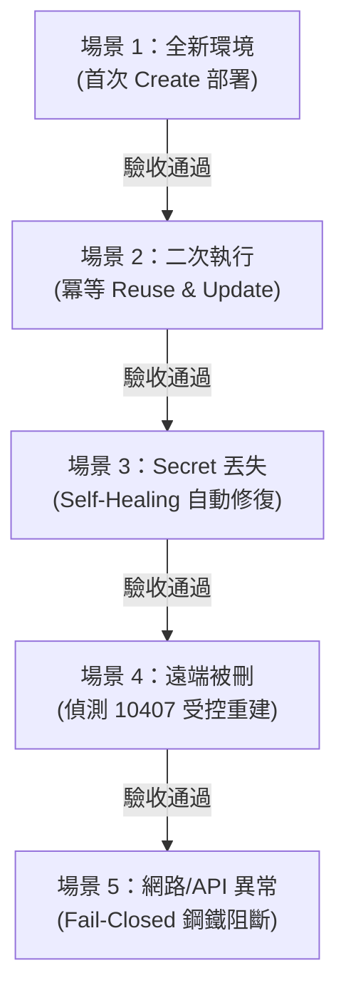

# ✅ 驗收測試規範與情境清單 (Acceptance Tests)

> **核心目標**：本文件定義系統在交付、發布或進行重大重構時，**「怎樣才算真正完成」的客觀驗收標準**。  
> 包含業務功能驗收、資安防護驗收、以及 5 大基礎設施與失效復原端對端測試（E2E Tests）。

---

## 🌾 1. 核心業務功能驗收 (Business Acceptance Tests)

| 編號 | 測試項目 | 預期行為 / 驗收標準 | 通過狀態 |
| :---: | :--- | :--- | :---: |
| **B-01** | **農民 LIFF 預約填單** | 農民在手機 LINE 開啟 LIFF，自動載入暱稱；填寫完畢送出後，前端顯示綠色預約成功畫面與 10 碼高熵單號（`BK-YYYYMMDD-10hex`）。 | ✅ |
| **B-02** | **服務幹部即時推播** | 農民送出預約後，`ADMIN_NOTIFY_USER_ID` 於數秒內在 LINE 收到美觀的 **LINE Flex Message**，顯示田區、聯絡電話，並提供「撥號」與「進入後台」按鈕。 | ✅ |
| **B-03** | **管理員後台鑑權** | 具備 `ADMIN_LINE_IDS` 白名單之人員，手機開啟後台自動通過 LINE Login 登入；非授權人員開啟顯示「權限不足 (403)」。 | ✅ |
| **B-04** | **農民被動查詢進度** | 農民在 LINE 官方帳號輸入「查詢預約」，機器人透過 Reply API（免費配額）秒回最近預約進度 Flex 卡片。 | ✅ |
| **B-05** | **站點排程管理** | 管理員可在後台標記案件狀態（待聯絡、已排程、已完成），並可設定「公休與封鎖日期」，前端預約表單即刻禁用該日期。 | ✅ |

---

## 🛡️ 2. 資安與邊界防護驗收 (Security & Boundary Acceptance Tests)

| 編號 | 測試項目 | 測試操作 | 預期行為 / 驗收標準 | 通過狀態 |
| :---: | :--- | :--- | :--- | :---: |
| **S-01** | **未授權存取後台 API** | 未帶 `Authorization: Bearer <id_token>` 存取 `/api/admin/bookings` | 伺服器立即回傳 `401 Unauthorized`，絕不洩漏預約資料。 | ✅ |
| **S-02** | **假冒 Webhook 簽章** | 以任意字串發送 POST 至 `/api/line/webhook` | HMAC-SHA256 驗簽未通過，伺服器立即回傳 `401`，不觸發 DB 或推播。 | ✅ |
| **S-03** | **惡意偽造 Turnstile** | 生產模式下傳送偽造或過期的 Turnstile Token 至預約 API | 伺服器嚴格 **Fail-Closed** 回傳 `403 Forbidden`，拒絕寫入。 | ✅ |
| **S-04** | **超大 Payload 攻擊** | 發送大於 32KB 之 POST 請求 | Hono 中介層於網關處直接攔截回傳 `413 Payload Too Large`。 | ✅ |
| **S-05** | **高頻暴力灌單限流** | 同一 IP + 電話於 10 分鐘內連續發送超過 10 次預約請求 | 複合限流中介層觸發，回傳 `429 Too Many Requests`。 | ✅ |
| **S-06** | **敏感日誌脫敏（PII）** | 檢查 Cloudflare Worker 即時除錯記錄 | 電話號碼中間 3 碼自動遮蔽（`0912***456`），無 raw body 洩漏。 | ✅ |
| **S-07** | **非關鍵副作用安全降級** | 模擬 LINE Push API 暫態 500 異常 | 預約成功寫入 D1，後端捕獲異常記錄警告，**不回滾**農友預約單。 | ✅ |

---

## 🤖 3. 基礎設施與失效復原 E2E 實機驗收 (Infrastructure & Failure Recovery Tests)

針對自動化工具鏈（`scripts/setup-turnstile.js`）與 Cloudflare 雲端整合之 5 大實機驗收場景：

### 場景 1：全新帳號/乾淨環境首次部署
- **測試方法**：在無本地 `.env`、遠端無 Widget 的環境下執行 `npm run setup:turnstile`。
- **驗收結果**：成功呼叫 Cloudflare 建立 Managed Widget，取得 `sitekey` 注入前端，透過 `stdin` 注入 Worker Secret，前後端全自動部署完成。

### 場景 2：二次重跑確認 100% 冪等性 (Idempotency)
- **測試方法**：在已部署成功的環境下，立即再次執行 `npm run setup:turnstile`。
- **驗收結果**：程式命中 Strategy A（本地 Site Key 復用）與 Strategy B，僅執行 `widget update` 同步網域，**絕不重複建立第二個孤兒 Widget**。

### 場景 3：Worker Secret 遺失之自我修復 (Self-Healing)
- **測試方法**：手動刪除 Cloudflare Worker 中的 `TURNSTILE_SECRET_KEY`，然後再次執行腳本。
- **驗收結果**：腳本自動調用 `widget get` 在記憶體安全提取配對 Secret，經管道重新同步回 Worker，環境自動修復健全。

### 場景 4：遠端 Widget 遭外部刪除之受控重整
- **測試方法**：保留本地舊配置，但手動於 Cloudflare 後台刪除該 Widget，隨後執行腳本。
- **驗收結果**：程式精確比對 Cloudflare 錯誤代碼 `10407 / deleted widget`，安全降級並受控重新建立新 Widget，絕不拋出未捕獲崩潰。

### 場景 5：模擬斷網與 API 異常之 Fail-Closed 阻斷
- **測試方法**：模擬 `widget list` 或 `widget update` 遭遇 500 錯誤或斷網。
- **驗收結果**：程式嚴格 **Fail-Closed** 安全中斷，輸出字典脫敏訊息，**絕不盲目掉入新建流程**，保護雲端環境狀態純淨。
