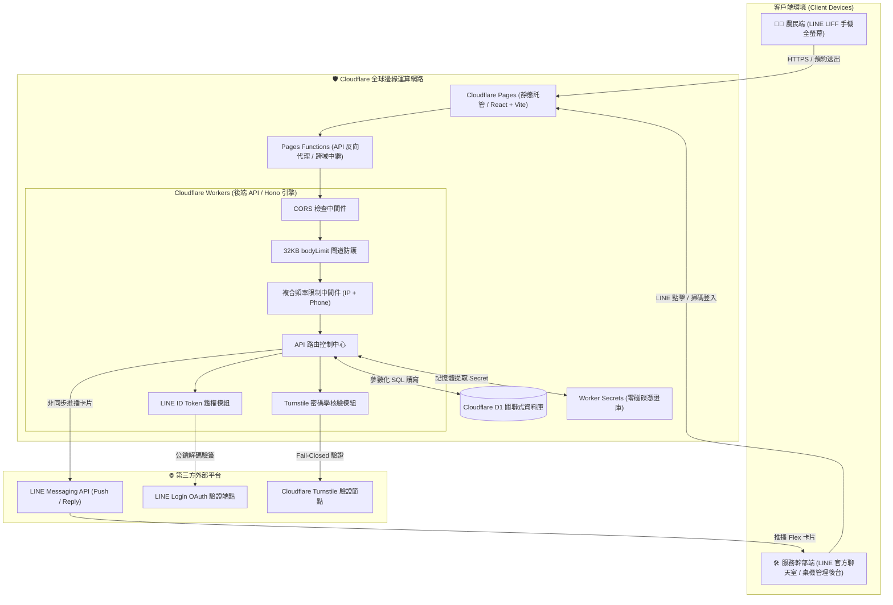

# 🏗️ 系統架構設計書 (Architecture Document) — open-booking-line

> **專案定位**：基於 Cloudflare Serverless（Workers + D1 + Pages）與 LINE LIFF 之輕量、高效能且具備企業級資安防禦的農業與在地資源預約管理系統。

---

## 🏛️ 全系統拓撲架構圖 (System Topology)



---

## 🧱 模組職責切分 (Monorepo Modules)

| 模組路徑 | 技術棧 | 核心責任 |
| :--- | :--- | :--- |
| **`packages/shared/`** | TypeScript | 雙端共用之型別定義（`BookingRequest`, `BookingRecord`）、表單狀態常數與錯誤代碼。 |
| **`packages/backend/`** | Cloudflare Workers, Hono, Web Crypto API | 後端 RESTful API、LINE Webhook 接收與 HMAC 驗簽、Turnstile 真人驗證、D1 資料庫存取、LINE Flex 推播通知。 |
| **`packages/frontend/`** | React 18, Vite, Tailwind CSS, LIFF SDK | 農民預約填單介面、Turnstile 智慧 Managed 互動視窗、服務人員後台管理面板、一鍵撥號與排程封鎖。 |
| **`scripts/`** | Node.js 原生腳本 (Zero-Shell) | `setup-turnstile.js`：具備三層冪等性與 Self-Healing 之 Turnstile 憑證全自動佈署工具。 |

---

## 🗄️ 資料庫結構設計 (Cloudflare D1 Schema)

### 1. 預約資料表 (`bookings`)
```sql
CREATE TABLE IF NOT EXISTS bookings (
  id TEXT PRIMARY KEY,               -- 預約單號 (BK-YYYYMMDD-10hex, 高熵防枚舉)
  created_at TEXT NOT NULL,          -- 建立時間 (ISO-8601)
  farmer_name TEXT NOT NULL,         -- 農友姓名 (<= 50 字元)
  phone TEXT NOT NULL,               -- 聯絡電話 (8~15 碼)
  crop_type TEXT NOT NULL,           -- 作物種類
  land_area TEXT NOT NULL,           -- 田區面積 (分地)
  wood_volume TEXT NOT NULL,         -- 粗估體積 (車次)
  location_area TEXT NOT NULL,       -- 鄉鎮市區
  location_address TEXT NOT NULL,    -- 詳細地址 (<= 200 字元)
  preferred_date TEXT NOT NULL,      -- 希望處理日期 (YYYY-MM-DD)
  preferred_time_slot TEXT NOT NULL, -- 希望時段 (上午/下午)
  date_flexibility TEXT,             -- 日期彈性 (可配合調度/不可變更)
  notes TEXT,                        -- 備註需求 (<= 500 字元)
  status TEXT NOT NULL DEFAULT 'to_contact', -- 案件狀態 (to_contact / scheduled / completed / cancelled)
  admin_memo TEXT,                   -- 服務人員內部備註 (僅管理員可存取，對外遮蔽)
  line_user_id TEXT                  -- 預約者 LINE User ID
);
```

### 2. 封鎖/公休日期表 (`blocked_dates`)
```sql
CREATE TABLE IF NOT EXISTS blocked_dates (
  date TEXT PRIMARY KEY,             -- 封鎖日期 (YYYY-MM-DD)
  reason TEXT,                       -- 封鎖原因 (例：公休、農機大保養)
  created_at TEXT NOT NULL           -- 設定時間 (ISO-8601)
);
```
