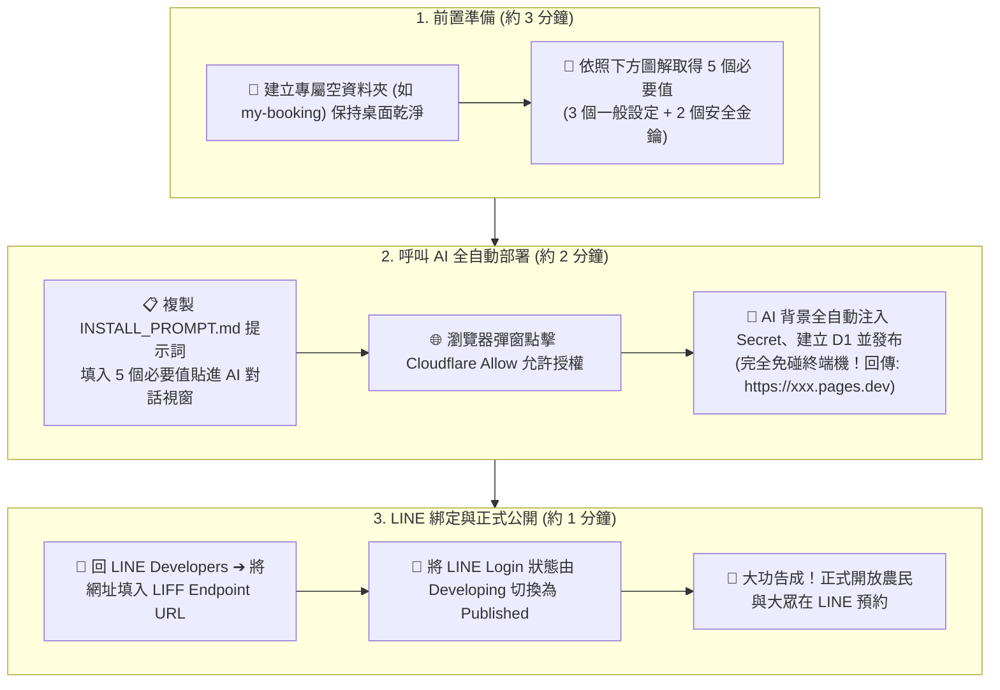

# 🌾 5 分鐘小白懶人包：零程式基礎也能架設的 LINE 預約系統

> **這份指南是專門為「沒有寫過程式」、「對 Cloudflare 或 LINE 後台完全不熟悉」的使用者設計的！**  
> 你不需要了解什麼是伺服器、資料庫或程式語言。只要像申請會員帳號一樣，按照圖文指引點幾下滑鼠、複製 5 個代碼交給 AI，整套預約系統就會全自動為你架設完成！

---

## 💡 30 秒搞懂：這套系統到底是什麼？

你可以把這套系統想像成你的**「24 小時免費雲端農場秘書」**：

```
👨‍🌾 農民 / 客人                     🤖 LINE 機器人                     🏢 站長 / 老闆
   │                                   │                                    │
   ├─ 1. 在 LINE 點開預約表 ───────────┤                                    │
   │  (手機全螢幕彈出，自動帶入暱稱)     │                                    │
   │                                   │                                    │
   ├─ 2. 填寫作物、面積、日期並送出 ────┼─ 3. 雲端大腦 (Cloudflare) 存檔 ─────┤
   │                                   │                                    │
   │                                   ├─ 4. LINE 發出「叮咚！」卡片推播 ────►│
   │                                   │  (顯示姓名、單號、作物、面積)        │
   │                                   │                                    │
   │                                   │  5. 點擊卡片上的「撥打電話」 ─────────┼─► 直接外撥聯絡客人
```

- **為什麼不用錢？**  
  我們使用全球最大雲端巨頭 **Cloudflare** 的永久免費方案，以及 **LINE 官方帳號** 的免費推播額度。不用租實體主機、不用買昂貴資料庫，**每個月維運成本就是 0 元**。
- **我完全不會寫程式怎麼辦？**  
  不需要！本專案採用「AI Agent 自動化安裝」，你只要把下方準備好的代碼交給 AI，AI 會在終端機幫你把所有檔案和資料庫全部設好。

## 🗺️ 5 分鐘完整執行順序全景圖



---

## 📋 步驟一：免費準備好 4 項資源

在開始前，請確認你擁有以下免費資源（免花錢、免綁信用卡）：

1. **[LINE 官方帳號 (LINE Official Account)](https://manager.line.biz/)**：發送預約推播通知與放置圖文選單的機器人，可免費線上申請（每月 200 則免費推播）。
2. **[LINE Developers 開發者帳號](https://developers.line.biz/console/)**：用你平常用的個人 LINE 帳號直接登入即可（免審核），用來取得 5 個必要值與 LIFF 預約門牌號碼。
3. **[Cloudflare 帳號](https://dash.cloudflare.com/sign-up)**：全球雲端平台，託管預約資料庫與網頁。支援以 Google 帳號一鍵免費登入（完全免綁信用卡）。
4. **一個 AI Coding Agent**：你的專屬雲端工程師，負責替你自動跑完全部安裝程序。
   - 🎁 **完全免費 0 元首選**：推薦使用 **OpenCode**（搭配 **Zen 免費帳號 + Muse spark free 1.3** 免費模型，完全免花一毛錢！）。
   - ⚡ **其他常見 AI 工具**：Google Antigravity、Claude Code、Cursor、Windsurf 等皆可。

---

## 🔑 步驟二：在 LINE 後台取得「5 個關鍵代碼」

這是唯一需要你手動點選的步驟。請打開 **[LINE Developers Console](https://developers.line.biz/console/)**：

### 1. 建立一個 Provider（服務提供者）
- 點擊 **Create a new provider**。
- 輸入你的農場或合作社名稱（例如：`阿蓮芭樂服務站`），按 Create。

---

### 2. 建立「Messaging API 頻道」（負責發通知的機器人）
在剛剛建立的 Provider 頁面內，點擊 **Create a new channel**，選擇 **Messaging API**：
- **Channel name**：機器人名稱（例如：`預約通知助理`）
- **Channel description**：預約推播服務
- **Category**：隨意選（如：農林漁牧）
- 勾選同意條款後按 **Create**。

建立後，我們要在這個頻道複製 **3 個代碼**：

| 代碼名稱 | 在哪裡點選？ | 它長什麼樣子？（特徵） | 用途解說 |
| :--- | :--- | :--- | :--- |
| **① LINE_CHANNEL_ACCESS_TOKEN** | 點分頁 **Messaging API** ➔ 滑到最下方找到 **Channel access token (long-lived)** ➔ 點右邊的 **Issue** 按鈕產生 | 一長串超過 150 個英數亂碼（像是一串很長的密碼） | 機器人的通行證，讓系統可以用這個機器人傳送 LINE 訊息 |
| **② ADMIN_NOTIFY_USER_ID** | 點分頁 **Basic settings** ➔ 滑到最下方找到 **Your user ID** | 以英文字母 **`U` 開頭的 33 碼字串**（例如 `U7c0c955efa...`） | **接收通知的老闆/幹部 LINE 代碼**。<br>⚠️ *注意：這不是你加好友用的 LINE ID，而是系統專用唯一識別碼！* |
| **③ LINE_CHANNEL_SECRET** | 點分頁 **Basic settings** ➔ 找到 **Channel secret** | 32 碼小寫英數混和字串（例如 `a1b2c3d4...`） | 密碼防偽鑰匙，防止外部壞人假冒 LINE 官方發假通知 |

---

### 3. 建立「LINE Login 頻道」（負責農民預約網頁與幹部免密碼登入）
回到剛剛的 Provider 頁面，點擊 **Create a new channel**，這次選擇 **LINE Login**：
- **Channel name**：服務入口名稱（例如：`線上預約系統`）
- **App types**：務必勾選 **Web app**
- 勾選同意條款後按 **Create**。

建立後，我們要複製最後 **2 個代碼**：

| 代碼名稱 | 在哪裡點選？ | 它長什麼樣子？（特徵） | 用途解說 |
| :--- | :--- | :--- | :--- |
| **④ LINE_LOGIN_CHANNEL_ID** | 點分頁 **Basic settings** ➔ 看到 **Channel ID** | 純 10 位數字（例如 `2011709076`） | 登入頻道代號，讓管理幹部用手機 LINE 一鍵免密碼登入 |
| **⑤ VITE_LIFF_ID** | 點分頁 **LIFF** ➔ 點 **Add** 按鈕 ➔ 填寫名稱（`預約表單`）、Size 選 `Full`、Endpoint URL 先隨便填 `https://example.com`、Scopes 勾選 `profile` 與 `openid` ➔ 送出 | 數字與英數組合（例如 `2011709076-09FdfkjH`） | **預約單門牌號碼**。農民點擊這串網址時，會在 LINE 裡面全螢幕彈出美觀預約單！ |

---

## 🤖 步驟三：把 5 個必要值在對話中直接發給 AI，全自動安裝完成！

> 💡 **完全免碰終端機！零指令、對話一鍵全搞定！**  
> 你不需要在終端機輸入任何繁瑣指令。只要在 AI 對話視窗（如 OpenCode, Claude Code, Antigravity, Cursor）中貼上下方填好的 5 個必要值，AI 就會在背景全自動將金鑰安全注入 Cloudflare，並建置好所有資料庫與網頁！

---

### 📁 新手重要觀念：為什麼需要一個專屬「專案資料夾」？

你可以把專案資料夾想像成**「專屬樂高收納箱」**：
1. **防止桌面被幾萬個檔案塞爆**：系統在自動建置時，會下載許多雲端零件（套件與暫存檔）。有了獨立資料夾，所有零件都會乖乖收在箱子裡，**絕對不會弄亂你的電腦桌面**。
2. **防止 AI 迷路報錯**：所有檔案集中在一起，AI 才能迅速找到正確路徑，不會因為找不到資料夾而卡住。
3. **隨時「一鍵乾淨重來」**：萬一哪天你不想用了，或者手滑弄壞了想重新裝，只要**把這個資料夾按右鍵丟進「資源回收筒」**，整台電腦 100% 恢復原狀，完全不留垃圾！

> 💡 **新手建議做法（二選一即可）**：
> - **做法 A（手動開箱，最推薦）**：在桌面空白處按右鍵 ➔「新增資料夾」（例如取名 `my-booking`）➔ 點進去這個空資料夾，再啟動 AI。
> - **做法 B（懶人全包）**：直接使用下方的提示詞，提示詞已經寫入目錄檢查指令，AI 會自動幫你在當前位置建立並收納進獨立資料夾！

---

你可以直接開啟 **[一鍵提示詞範本 (INSTALL_PROMPT.md)](INSTALL_PROMPT.md)**，或是直接複製下方文字填寫：

```text
你好！請幫我全自動安裝 open-booking-line。

【目錄安全檢查】：
請先確認當前目錄是否為 open-booking-line 專案根目錄。
若不是，請先在當前位置建立獨立資料夾「open-booking-line」（或執行 git clone https://github.com/chingfonlee/open-booking-line.git 並切換進去），確保所有後續指令與檔案皆在該資料夾內執行，嚴禁污染外層目錄。

這是我的 5 個必要值：
LINE_CHANNEL_ACCESS_TOKEN=（貼上第 ① 項長串密碼）
LINE_CHANNEL_SECRET=（貼上第 ③ 項 32 碼 Secret）
ADMIN_NOTIFY_USER_ID=（貼上第 ② 項 U 開頭的 ID）
LINE_LOGIN_CHANNEL_ID=（貼上第 ④ 項 10 位數字）
VITE_LIFF_ID=（貼上第 ⑤ 項 LIFF ID）
STATION_NAME=阿蓮芭樂服務站（寫上你的農場或服務站名字）

🔒 【Zero-Disk 零磁碟落地資安守則】：
請嚴格遵守專案的 Zero-Disk 安全規範：
- 將 LINE_CHANNEL_ACCESS_TOKEN 與 LINE_CHANNEL_SECRET 透過記憶體管線（stdin）直接注入 Cloudflare Worker Secret。
- 嚴禁將上述任何金鑰寫入硬碟檔案（如 .env、wrangler.toml）、Git 倉庫或終端日誌。

請依照專案內的 AGENTS.md 與 DEPLOYMENT_GUIDE.md 規範，全自動完成：
1. 執行 npx wrangler login 喚起瀏覽器供我授權 Cloudflare（我只需在網頁點擊 Allow）。
2. Cloudflare D1 資料庫建立與 Schema 初始化（自動取得 database_id）。
3. 自動推導 ADMIN_LINE_IDS 與 LIFF_ID，並配置 packages/backend/wrangler.toml。
4. 透過 Zero-Disk 安全管線將 LINE 金鑰寫入 Worker Secrets。
5. 自動產生 packages/frontend/.env 並編譯發布 Cloudflare Pages 與 Worker API。
6. 執行連線健康檢查（/api/health），並提供我部署完成的 Pages 網址。

除了 Cloudflare 瀏覽器授權（wrangler login）需要我點擊「Allow」外，其餘所有建置與設定步驟請自行全自動完成，我不需要在終端機輸入任何指令。謝謝！
```

### 給使用者的極簡操作（只需 3 動）：
1. **在 AI 對話視窗貼上**：  
   把上方填好的提示詞整段複製，發送給 AI Agent。
2. **瀏覽器點擊允許 (Allow)**：  
   AI 執行到雲端登入時，瀏覽器會自動彈出 Cloudflare 授權視窗，點一下 **「Allow（允許）」** 即可。
3. **泡杯咖啡等 2 分鐘**：  
   AI 會在背景全自動建立雲端資料庫、注入金鑰、打包網頁、部署 Worker 後端，完成後會交給你一個專屬的網址（例如：`https://my-farm.pages.dev`）！

---

## 🎯 最後兩步（1 分鐘收尾）：綁定 LINE 網址與正式公開

當 AI 告訴你部署成功並給你網址（例如 `https://my-farm.pages.dev`）後，請回到 [LINE Developers Console](https://developers.line.biz/console/) 進行最後兩步設定：

### 1. 綁定 LIFF 網址
1. 進入剛剛建立的 **LINE Login** 頻道 ➔ 點擊 **LIFF** 分頁。
2. 找到剛剛建立的 LIFF 應用，點進去修改 **Endpoint URL**：
   - 把原本隨便填的 `https://example.com` 改成 AI 給你的網址：`https://my-farm.pages.dev`。
3. 按下 **Update（儲存）**。

### 2. 將 LINE Login 頻道切換為「Published（公開）」
> 🚨 **關鍵步驟**：LINE 平台新建立的頻道預設為 **`Developing`（開發中）**。此時只有你自己能打開，**外部客人的手機打開會顯示「此服務目前正在開發中」**！
1. 在 **LINE Login** 頻道頁面最頂部，找到頻道名稱旁邊的狀態標籤。
2. 點擊 **`Developing`** 並切換為 **`Published`**。

🎉 **大功告成！** 現在任何人點擊你的 LIFF 連結，都能順暢打開表單完成預約囉！

---

## ⚠️ 重要提醒：目前為「體驗測試防護」模式

> **🟡 測試完成判斷指引**：
> - **只是自己與內部同仁測試？** ➔ **到此即可！** 目前系統功能 100% 完整，開箱即可開始測試填單與接收 LINE 推播。
> - **準備公開給真實客戶使用？** ➔ 請進行下方「正式 Turnstile 真人防護」升級，全面防禦惡意機器人！

目前系統預設採用 Cloudflare 官方的 **Always-Pass 測試金鑰**（`1x...AA`），因此任何送單都會自動通過驗證。在正式對外營運前，建議啟用專屬免費的 Cloudflare Turnstile 真人防護，防止自動化腳本或惡意爬蟲刷單、耗損您每個月的 LINE 免費推播額度：

### 🤖 推薦方式：讓 AI Agent 全自動幫你完成（正常情況全自動；若 Cloudflare 授權較舊，只需額外點一次 Allow）
你完全不需要自己進入 Cloudflare 後台摸索！只要打開終端機，對 AI Agent 說這句話：
```text
我測試完成了，請幫我啟用正式 Turnstile 防護！
```
AI 就會全自動：
1. 透過 Cloudflare CLI 在你的帳號下建立專屬 Turnstile Widget。
2. 自動取得 Site Key 寫入前端，並將 Secret 安全存入 Worker Secret（無檔案落地、不進 Git）。
3. 自動重新打包並完成雲端發布！

---

### 🛠️ 備用手動方式（若你想自己手動操作）：
1. 前往 [Cloudflare 控制台](https://dash.cloudflare.com/) ➔ 點擊左側選單 **Turnstile**。
2. 點擊 **Add site**：
   - **Site name**：填入你的站點名稱（例如：`阿蓮芭樂預約站`）。
   - **Domain**：填入你的 Pages 網址（例如：`my-farm.pages.dev`）。
   - **Widget Mode**：選擇 **Managed**（無感自動驗證）。
3. 取得 **Site Key** 與 **Secret Key** 兩組字串。
4. 設定至系統：
   - **前端**：在 `packages/frontend/.env` 設定 `VITE_TURNSTILE_SITE_KEY=你的_Site_Key` 並重新打包部署前端。
   - **後端**：在 `packages/backend` 執行指令安全存入 Worker Secret（絕不寫入檔案、不進 Git）：
     ```bash
     cd packages/backend
     npx wrangler secret put TURNSTILE_SECRET_KEY
     ```
     （依提示貼上 Secret Key 即可）

> 💡 系統具備**智慧雙軌防禦**機制：一旦更換為正式金鑰，後端將自動啟動嚴格的 Fail-Closed 密碼學核驗，全面封鎖任何機器人與虛擬測試 Token！
