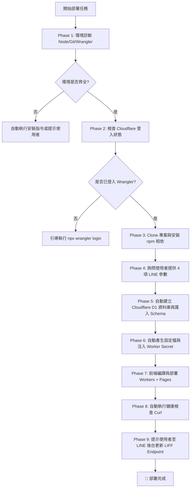

# 🚀 行農預約系統 · Agent 全自動化部署與技術規範懶人包
> **Target Audience**: 專門設計供 **AI Coding Agent**（如 Claude Code, Antigravity, Cursor, Devin, GitHub Copilot 等）讀取並自主執行，以最高自動化、最少使用者介入的方式完成專案檢測、建置與雲端部署。同時提供使用者必備之外部平台申請步驟。  
> 💡 **如果您是完全沒有程式經驗的新手**：請直接閱讀 **[新手白話圖文指南 (BEGINNER_GUIDE.md)](BEGINNER_GUIDE.md)**，本文件專供技術人員與 AI Agent 讀取執行。

---

## 📑 目錄
1. [Agent 執行指令與狀態流程圖](#1-agent-執行指令與狀態流程圖)
2. [技術規格與架構規範](#2-技術規格與架構規範)
3. [使用者前置準備（需人工操作清單）](#3-使用者前置準備需人工操作清單)
4. [Agent 自動化執行 SOP（逐步操作）](#4-agent-自動化執行-sop逐步操作)
5. [部署後驗證與設定收尾（含 Published 切換）](#5-部署後驗證與設定收尾)
6. [LINE 官方帳號（OA）整合與對外推廣指引](#6-line-官方帳號oa整合與對外推廣指引)
7. [常見問題與故障排除](#7-常見問題與故障排除)

---

## 1. Agent 執行指令與狀態流程圖



### 🤖 給 Agent 的重要指引
1. **盡可能自動化**：除「平台帳號註冊」與「取得 LINE 金鑰」需使用者手動提供外，環境檢查、依賴安裝、資料庫建立、檔案設定、建置與部署皆應由 Agent 透過終端機指令全自動完成。
2. **參數收集原則**：向使用者索取以下 4 個必要參數後即可啟動全自動部署流程：
   - `LINE_CHANNEL_ACCESS_TOKEN`（Messaging API 長效金鑰）
   - `ADMIN_NOTIFY_USER_ID`（接收通知的服務人員 LINE User ID，以 `U` 開頭）
   - `LINE_LOGIN_CHANNEL_ID`（LINE Login Channel ID，數字）
   - `VITE_LIFF_ID`（LIFF 應用 ID，格式如 `2000000000-XXXXXXXX`）

---

## 2. 技術規格與架構規範

| 系統層級 | 技術選型 | 規格與責任 |
| :--- | :--- | :--- |
| **架構模式** | Monorepo | `packages/shared`, `packages/backend`, `packages/frontend` |
| **前端應用** | Cloudflare Pages | React 18, Vite, TypeScript, Tailwind CSS, Lucide React, `@line/liff` |
| **後端 API** | Cloudflare Workers | Hono 輕量高效框架, Node.js Compat, TypeScript, Web Crypto API |
| **資料庫** | Cloudflare D1 | 雲端分散式 Serverless SQLite，雙資料表 (`service_requests`, `blocked_dates`) |
| **身分驗證** | LINE OAuth ID Token | 後端呼叫 LINE 官方 `/oauth2/v2.1/verify` 驗證簽名，取得真實 `sub`（User ID） |
| **管理權限** | 服務人員白名單 (`ADMIN_LINE_IDS`) | 僅限白名單 LINE 帳號登入管理後台，手機自動授權、桌機支援 QR Code 掃描 |
| **Webhook 防偽** | 原生 HMAC-SHA256 | 後端使用 Web Crypto API 校驗 `x-line-signature`，阻擋偽造 Webhook 事件 |
| **跨域防禦** | 動態 CORS 白名單 | 支援 `ALLOWED_ORIGINS` 環境變數配置，隔離惡意跨站刷單，預設僅允許自家 Pages 與 LIFF |
| **身分鑑權** | 純 LINE 白名單（Zero-Password） | 徹底移除靜態 PIN 密碼，100% 透過 LINE 官方 ID Token 鑑權，零密碼洩漏與爆破風險 |
| **安全防護** | Cloudflare Turnstile | 表單前端零摩擦無感真人驗證，防止惡意腳本刷單與耗損 LINE 免費推播 |
| **頻率限制** | IP + Phone Composite Window | 10 分鐘內最多 5 次送單，兼顧防刷單與台灣電信基地台 CGNAT 相容性 |
| **安全標頭** | HTTP Security Headers | 全域注入 nosniff、SAMEORIGIN、strict-origin-when-cross-origin 防點擊劫持與嗅探 |
| **營運成本** | 100% 免費額度支援 | Cloudflare 免費方案（Workers 10萬次/日 + Pages 無限頻寬 + D1 500萬次讀取/日）+ LINE 官方免費 200 則推播/月 |

---

## 3. 使用者前置準備（需人工操作清單）

請使用者依照以下 3 個步驟建立帳號並取得 4 個核心參數：

### 步驟 1：Cloudflare 帳號註冊與登入
1. 開啟 [Cloudflare 註冊頁面](https://dash.cloudflare.com/sign-up)。
2. 註冊帳號並完成電子郵件驗證。
3. （無需綁定信用卡，本專案完全運行於免費方案）。

---

### 步驟 2：LINE Developers 建立應用與取得金鑰
開啟 [LINE Developers Console](https://developers.line.biz/console/) 並登入個人 LINE 帳號。

#### 2-1 建立 Provider
- 若已有 Provider 可直接點入，若無請點擊 **Create a new provider**，輸入名稱（例如：`行農合作社`）。

#### 2-2 建立 Messaging API Channel（推播機器人）
1. 在 Provider 頁面點擊 **Create a new channel**，選擇 **Messaging API**。
2. 填寫名稱（例如：`高雄服務站預約助理`）、描述與類別後送出。
3. 進入該 Channel 頁面：
   - 點擊 **Messaging API** 分頁：
     - 滑至最下方找到 **Channel access token (long-lived)**，點擊 **Issue** 產生長效 Token。
     - 複製此 Token ➡️ **`LINE_CHANNEL_ACCESS_TOKEN`**。
   - 點擊 **Basic settings** 分頁：
     - 滑至最下方找到 **Your user ID**（以 `U` 開頭的 33 碼字串）。
     - 複製此 ID ➡️ **`ADMIN_NOTIFY_USER_ID`**。
     - 找到 **Channel secret**（32 碼字串）。
     - 複製此 Secret ➡️ **`LINE_CHANNEL_SECRET`**（必填：啟用 Webhook HMAC-SHA256 密碼學防偽驗簽）。

#### 2-3 建立 LINE Login Channel 與 LIFF（農友表單與服務人員登入）
1. 回到 Provider 頁面，點擊 **Create a new channel**，選擇 **LINE Login**。
2. 填寫名稱（例如：`行農服務站預約入口`），App types 勾選 **Web app**。
3. 建立後，在 **Basic settings** 分頁：
   - 找到 **Channel ID**（純數字）➡️ **`LINE_LOGIN_CHANNEL_ID`**。
4. 點擊 **LIFF** 分頁，點擊 **Add**：
   - **LIFF app name**：`預約申請表`
   - **Size**：選擇 `Full`
   - **Endpoint URL**：先暫填 `https://example.com`（待部署完成後再更新為真實 Pages 網址）
   - **Scopes**：勾選 `profile` 與 `openid`
   - **Bot prompt**：選擇 `Normal`
5. 點擊 **Add** 送出，在清單中複製 **LIFF ID**（格式如 `2000000000-xxxxxxxx`）➡️ **`VITE_LIFF_ID`**。

---

### 步驟 3：將取得的參數提供給 Agent
使用者請將下列資訊複製並填寫後，發送給 AI Agent：

```text
LINE_CHANNEL_ACCESS_TOKEN=（填入 Messaging API Channel Access Token）
LINE_CHANNEL_SECRET=（填入 Messaging API Channel Secret 32 碼，必填安全項）
ADMIN_NOTIFY_USER_ID=（填入以 U 開頭的服務人員個人 LINE User ID）
ADMIN_LINE_IDS=（填入授權服務人員 LINE User ID 白名單，可多個以逗號隔開）
LINE_LOGIN_CHANNEL_ID=（填入 LINE Login Channel ID 數字）
VITE_LIFF_ID=（填入 LIFF ID，供前端使用）
LIFF_ID=（填入與上方相同之 LIFF ID，供後端推播卡片跳轉按鈕使用）
STATION_NAME=高雄服務站（選填，預設為高雄服務站）
```

---

## 4. Agent 自動化執行 SOP（逐步操作）

> **Agent 執行環境要求**：Windows PowerShell / macOS Terminal / Linux Bash。

### Step 1: 環境檢查與自動安裝
Agent 執行以下指令檢查本機工具鏈：
```bash
node -v
npm -v
git --version
npx wrangler -v
```

- 若缺少 **Node.js**（需 >= 18.0.0）：
  - **Windows**: `winget install OpenJS.NodeJS.LTS`
  - **macOS**: `brew install node`
  - **Ubuntu/Debian**: `curl -fsSL https://deb.nodesource.com/setup_20.x | sudo -E bash - && sudo apt-get install -y nodejs`
- 若缺少 **Git**:
  - **Windows**: `winget install Git.Git`
  - **macOS**: `brew install git`

---

### Step 2: 檢查 Cloudflare 登入認證
Agent 執行指令：
```bash
npx wrangler whoami
```
- 若顯示 `You are not logged in.`，Agent 指導使用者於終端機執行：
```bash
npx wrangler login
```
（瀏覽器會自動彈出 Cloudflare 授權視窗，使用者點擊「Allow」授權即可完成）。

---

### Step 3: Clone 專案與安裝相依套件
Agent 執行：
```bash
git clone https://github.com/chingfonlee/open-booking-line.git
cd open-booking-line
npm install
```

---

### Step 4: Cloudflare D1 資料庫建立與 Schema 初始化
Agent 執行以下指令自動建立資料庫：
```bash
npx wrangler d1 create xingnong-db
```
- Agent 自動從終端機輸出中解析 `database_id = "xxxxxxxx-xxxx-xxxx-xxxx-xxxxxxxxxxxx"`。

Agent 執行資料庫結構初始化建表：
```bash
npx wrangler d1 execute xingnong-db --command "
CREATE TABLE IF NOT EXISTS service_requests (
  id TEXT PRIMARY KEY,
  created_at TEXT NOT NULL,
  updated_at TEXT NOT NULL,
  contact_name TEXT NOT NULL,
  phone TEXT NOT NULL,
  service_type TEXT NOT NULL,
  crop_type TEXT NOT NULL,
  area_size TEXT NOT NULL,
  area_value TEXT,
  area_unit TEXT,
  branch_volume TEXT,
  location_area TEXT NOT NULL,
  location_address TEXT NOT NULL,
  preferred_date TEXT NOT NULL,
  preferred_time_slot TEXT NOT NULL,
  date_flexibility TEXT,
  notes TEXT,
  status TEXT NOT NULL DEFAULT 'to_contact',
  admin_memo TEXT,
  line_user_id TEXT
);
CREATE TABLE IF NOT EXISTS blocked_dates (
  date TEXT PRIMARY KEY,
  reason TEXT,
  created_at TEXT NOT NULL
);
"
```

---

### Step 5: 設定檔與金鑰自動注入

#### 5-1 更新 `packages/backend/wrangler.toml`
Agent 將收集到的參數與上一步取得的 `database_id` 寫入 `packages/backend/wrangler.toml`：
```toml
name = "line-bot-farm-api"
main = "src/index.ts"
compatibility_date = "2024-09-23"
compatibility_flags = [ "nodejs_compat" ]

[[d1_databases]]
binding = "DB"
database_name = "xingnong-db"
database_id = "<REPLACE_WITH_DATABASE_ID>"

[vars]
STATION_NAME = "<REPLACE_WITH_STATION_NAME>"
ADMIN_NOTIFY_USER_ID = "<REPLACE_WITH_ADMIN_NOTIFY_USER_ID>"
ADMIN_LINE_IDS = "<REPLACE_WITH_ADMIN_NOTIFY_USER_ID>"
LINE_LOGIN_CHANNEL_ID = "<REPLACE_WITH_LINE_LOGIN_CHANNEL_ID>"
LIFF_ID = "<REPLACE_WITH_LIFF_ID>"
TURNSTILE_SECRET_KEY = "1x0000000000000000000000000000000AA"
ALLOWED_ORIGINS = "https://*.pages.dev"
```

#### 5-2 注入 LINE 金鑰至 Worker Secret
Agent 於 `packages/backend` 執行：
```bash
cd packages/backend
echo "<REPLACE_WITH_LINE_CHANNEL_ACCESS_TOKEN>" | npx wrangler secret put LINE_CHANNEL_ACCESS_TOKEN
# 注入 LINE_CHANNEL_SECRET（必填：啟用 Webhook 密碼學防偽驗簽）：
echo "<REPLACE_WITH_LINE_CHANNEL_SECRET>" | npx wrangler secret put LINE_CHANNEL_SECRET
cd ../..
```

#### 5-3 寫入前端 `.env`
Agent 建立 `packages/frontend/.env`：
```env
VITE_LIFF_ID=<REPLACE_WITH_VITE_LIFF_ID>
VITE_STATION_NAME=<REPLACE_WITH_STATION_NAME>
# 後端 API 網址：若前端與後端分開部署，可填入 Worker 網址（例如：https://line-bot-farm-api.<your-account>.workers.dev）；留空則走同源 Pages Functions 反向代理
VITE_API_BASE_URL=https://line-bot-farm-api.<your-account>.workers.dev
VITE_TURNSTILE_SITE_KEY=1x00000000000000000000AA
```

---

### Step 6: 前端編譯建置
Agent 於專案根目錄執行：
```bash
npm run build:frontend
```
確認輸出 `dist/index.html` 產生且建置無報錯。

---

### Step 7: 雲端部署

#### 7-1 部署後端 API (Cloudflare Worker)
Agent 執行：
```bash
cd packages/backend
npx wrangler deploy
cd ../..
```
- 部署完成後，記下終端機輸出的 Worker 網址（例如 `https://line-bot-farm-api.<your-account>.workers.dev`）。

#### 7-2 部署前端 (Cloudflare Pages)
Agent 執行：
```bash
cd packages/frontend
npx wrangler pages deploy dist --project-name xingnong-farm --commit-dirty=true
cd ../..
```
- 部署完成後，記下終端機輸出的 Pages 正式網址（例如 `https://xingnong-farm.pages.dev`）。

---

## 5. 部署後驗證與設定收尾

### 驗證 1：後端健康檢查 (API Health Check)
Agent 自動執行連線測試：
```bash
curl -s https://<YOUR_PAGES_DOMAIN>/api/health
```
若回傳包含 `{"status":"ok","station":"..."}` 即表示前端 Pages Proxy 與後端 Workers API 連線正常！

### 驗證 2：更新 LIFF Endpoint URL
Agent 向使用者提示：
> 📢 **步驟 A：請回 LINE Developers 綁定網址**
> 1. 開啟 [LINE Developers Console](https://developers.line.biz/console/)。
> 2. 進入先前建立的 **LINE Login Channel** ➡️ **LIFF** 標籤。
> 3. 點擊進入您的 LIFF App，將 **Endpoint URL** 修改為剛才部署完成的 Pages 網址：
>    `https://<YOUR_PAGES_DOMAIN>`（例如 `https://xingnong-farm.pages.dev`）。
> 4. 點擊 **Update** 儲存。

### 驗證 3：將 LINE Login 頻道切換為 Published（開放給一般大眾）
> 🚨 **關鍵步驟：若未切換，外部一般用戶將無法開啟 LIFF！**
> - **原因**：LINE 平台新建立的 Channel 預設皆為 **`Developing`（開發中）** 狀態。在開發中狀態下，**只有頻道擁有者或在「Roles」內的使用者可以開啟**；其他一般用戶開啟時會出現「此服務目前正在開發中 / 無法使用」錯誤。
> - **操作方式**：
>   1. 在 [LINE Developers Console](https://developers.line.biz/console/) 點進您的 **LINE Login Channel**。
>   2. 查看頁面最頂部、頻道名稱旁邊的狀態膠囊標籤。
>   3. 將 **`Developing`** 點擊並切換為 **`Published`**。
>   4. 切換後，任何一般 LINE 使用者點擊您的 LIFF 連結皆能順暢開啟並預約！

---

## 6. LINE 官方帳號（OA）整合與對外推廣指引

當系統部署完成並切換為 `Published` 後，您可以透過以下方式讓農友快速進入預約表單與查詢進度：

### 1. 取得農友專用 LIFF 連結
在 LINE Developers 的 LIFF 分頁中，複製 **LIFF URL**，格式如下：
```text
https://liff.line.me/<YOUR_LIFF_ID>
```
（在 LINE 聊天室中點擊此連結，會直接在手機以原生全螢幕 Webview 開啟，體驗極佳）。

---

### 2. 放置於官方帳號「圖文選單」(Rich Menu) 推薦配置
登入 [LINE Official Account Manager (官方帳號管理後台)](https://manager.line.biz/) ➡️ **聊天室相關** ➡️ **圖文選單** ➡️ 點擊 **建立圖文選單**：

| 按鈕區域 | 動作類型 (Action) | 設定內容 | 說明 |
| :--- | :--- | :--- | :--- |
| **按鈕 A：申請預約** | **連結 (URL)** | `https://liff.line.me/<YOUR_LIFF_ID>` | 點擊秒開原生預約表單，乾淨清爽 |
| **按鈕 B：查詢進度** | **文字 (Text)** | `查詢預約` | 點擊在對話室發送文字，機器人秒回進度 Flex 卡片 |

---

### 3. 🚨 LINE Webhook 雙開關啟用設定（非常關鍵！）
> ⚠️ **若漏掉以下任一開關，農民在 LINE 對話框輸入「查詢預約」時，系統將完全收不到訊息且無法回傳卡片！**
> 本查詢功能採用 LINE 原生 **Reply API（被動回覆）**，**100% 免費且不扣除每月 200 則免費推播額度**。

#### 🔹 開關 1：LINE 官方帳號管理後台「開啟 Webhook」（最容易漏掉！）
1. 登入 [LINE Official Account Manager](https://manager.line.biz/)。
2. 點擊右上角 **「設定」**（齒輪圖示） ➡️ 左側選單 **「回應設定」**。
3. 檢查以下兩項：
   - **回應模式**：選擇 **「聊天」** 或 **「聊天機器人」**。
   - **Webhook**：👉 **務必勾選為「開啟」**！（系統預設多為關閉，若關閉則 LINE 會在前端攔截訊息，不會轉交給後端 API）。

#### 🔹 開關 2：LINE Developers 後台「開啟 Use webhook」
1. 登入 [LINE Developers Console](https://developers.line.biz/console/)。
2. 點進您的 **Messaging API Channel**。
3. 切換至 **Messaging API** 分頁，滑至 **Webhook settings**：
   - **Webhook URL** 點擊 Edit 輸入：
     ```text
     https://<YOUR_WORKER_DOMAIN>/api/line/webhook
     ```
     （例如 `https://line-bot-farm-api.<your-account>.workers.dev/api/line/webhook`）。
   - 點擊 **Verify** 按鈕（應顯示 Success）。
   - 👉 **務必將「Use webhook」切換為開啟（綠色 Enabled）**（預設為 Disabled 關閉）。

---

### 4. 設定「加入好友歡迎訊息」
在官方帳號後台設定：
> 「您好！歡迎加入行農合作社服務專區 🌾
> 
> 若您有果樹枝條粉碎、代耕或農機租借需求：
> 🌱 **線上申請預約**：請點選下方選單或開啟 https://liff.line.me/<YOUR_LIFF_ID>
> 📋 **查詢預約進度**：請在對話框直接輸入【查詢預約】或點選選單，即可查看最新排程狀態！」

---

### 5. Cloudflare Turnstile 真人防護模式與正式金鑰申請（重要提醒）

本專案預設已配置 Cloudflare 官方 **Invisible 隱形測試金鑰**（`2x00000000000000000000AB`），此模式下：
- **零干擾體驗**：表單下方完全不會出現任何灰色方塊或「僅用於測試」等警告橫幅。
- **背景自動鑑權**：農友送單時全自動通過檢核，體驗清爽順暢。

> 💡 **若要取得正式專屬防爬蟲保護（推薦生產環境申請，完全免費）：**
> 1. 登入 [Cloudflare Dashboard](https://dash.cloudflare.com/) ➡️ 點選左側選單的 **Turnstile**。
> 2. 點擊 **Add site**（新增網站）：
>    - **Site name**：輸入專案名稱（例如 `行農合作社預約`）
>    - **Domain**：填入您的 Pages 網址（例如 `xingnong-farm.pages.dev`）
>    - **Widget Mode**：強烈推薦選擇 **Invisible（隱形無感模式）**，畫面完全乾淨無任何方塊！
> 3. 點擊 **Create**，複製產生的：
>    - **Site Key** ➡️ 填入前端 `packages/frontend/.env` 的 `VITE_TURNSTILE_SITE_KEY`
>    - **Secret Key** ➡️ 填入後端 `packages/backend/wrangler.toml` 的 `TURNSTILE_SECRET_KEY`
> 4. 重新執行 `npm run build:frontend` 與 `npx wrangler deploy` 即可生效。

---

## 🔒 5.1 🚀 正式營運安全加固 Check List（3 步驟無痛升級生產環境）

> 💡 **教學展示 vs 正式營運說明**：
> 本專案為降低新手首次安裝與測試門檻，預設提供 Cloudflare 官方測試金鑰容錯與本機友善機制（開箱即測）。
> **若您準備將此系統投入真實農場或商家對外營運，強烈建議完成以下 3 項加固步驟（耗時約 2 分鐘，全部 100% 免費）：**

### 1. 啟用 LINE Webhook 強制密碼學驗簽 (Fail-Closed)
- **原因**：防止未授權的第三方惡意 POST 偽造 LINE 訊息刷爆資料庫或推播額度。
- **作法**：至 [LINE Developers Console](https://developers.line.biz/) ➡️ 進入您的 Messaging API Channel ➡️ **Basic settings** 分頁複製 **Channel secret**。
- **終端機執行**：
  ```bash
  cd packages/backend
  npx wrangler secret put LINE_CHANNEL_SECRET
  # 依提示貼上 Channel secret 即可
  ```
- **效果**：後端即刻啟動原生 Web Crypto API 恆定時間 HMAC-SHA256 驗簽，非官方伺服器發送的請求一律 401 拒絕。

### 2. 替換為專屬 Cloudflare Turnstile 正式金鑰
- **原因**：預設測試金鑰（`1x000...`）僅供展示與本機驗證，正式上線必須啟用專屬真人行為分析，阻擋爬蟲與機器人刷單。
- **作法**：
  1. 登入 [Cloudflare Dashboard](https://dash.cloudflare.com/) ➡️ 左側選單 **Turnstile** ➡️ 點擊 **Add site**。
  2. 輸入站點名稱，網域填入您的 Pages 網址（例如 `your-app.pages.dev`），模式選擇 **Invisible（隱形無感）**。
  3. 將產生的 **Site Key** 填入 `packages/frontend/.env` 的 `VITE_TURNSTILE_SITE_KEY`。
  4. 將產生的 **Secret Key** 透過指令安全託管：
     ```bash
     cd packages/backend
     npx wrangler secret put TURNSTILE_SECRET_KEY
     ```
  5. 重新發布前端：`npm run build:frontend && npm run deploy:frontend`。

### 3. (選用) 開啟 Cloudflare 免費 WAF Rate Limiting 邊緣限流
- **原因**：本專案代碼內建 `IP + Phone` 滑動視窗限流（0 外部依賴）。若需要進一步抵禦跨區域分散式攻擊，可直接利用 Cloudflare 免費 WAF 規則達成全域邊緣即時阻斷。
- **作法**：
  1. 於 Cloudflare Dashboard 進入您的網域 ➡️ **Security** ➡️ **WAF** ➡️ **Rate limiting rules**。
  2. 點擊 **Create rule**（免費方案即享 1 條自訂規則）：
     - **Rule name**：`Protect Booking API`
     - **If incoming requests match**：`URI Path equals /api/requests` AND `Request Method equals POST`
     - **Rate**：`5 requests per 10 minutes`
     - **Action**：`Block`
  3. 點擊 **Deploy** 即生效，由 Cloudflare 邊緣直接阻絕惡意攻擊，不耗費任何 Worker 運算配額。

---

## 🔒 6. 專案安全性架構與安裝檢驗指引 (Security Verification)

本專案已完成全面性的企業級資安加固，安裝者與 AI Agent 在完成部署後，可透過本章節了解防護機制與自我檢測方式：

### 🛡️ 8 大核心防護機制與漏洞防範

| 防護項目 | 漏洞威脅與潛在風險 | 本專案實作之防禦機制 |
| :--- | :--- | :--- |
| **1. Webhook 防偽驗簽** | 惡意第三方直接 POST 請求發送偽造 LINE 訊息，盜刷 D1 資料庫或消耗推播額度。 | 採用原生 Web Crypto API 計算 `x-line-signature` 之 **HMAC-SHA256** 簽名校驗，杜絕偽造。 |
| **2. 純 LINE 白名單鑑權** | 靜態密碼容易被暴力破解、洩漏或遭 XSS 竊取。 | **徹底拔除 PIN 碼（零密碼架構）**，管理端 100% 透過 LINE 官方 ID Token 驗證，手機自動鑑權、電腦掃碼登入。 |
| **3. 動態 CORS 網域隔離** | 全開 `cors('*')` 易遭惡意網站跨站請求偽造；硬編碼網域則導致換網域時無法使用。 | 支援 `ALLOWED_ORIGINS` 動態白名單（支援萬用字元如 `*.pages.dev`），預設僅信任本機開發與 LINE LIFF。 |
| **4. 嚴格 Header 憑證傳輸** | 透過 URL Query 傳參，密鑰易殘留於瀏覽器歷程與伺服器 Log。 | **全面取消 URL Query 認證**，一律由 HTTP Header（`Authorization: Bearer`）傳遞短效 Token。 |
| **5. 除錯測試端點收斂** | 公開測試卡片端點可能被任何人任意呼叫觸發 Push，消耗免費配額。 | 測試端點收整至 `/api/admin/debug/test-card`，必須具備服務人員白名單授權 Token 始可調用。 |
| **6. 電信級複合頻率限制** | 純 IP 限流在行動網路（4G/5G）常因基地台 CGNAT 共享 IP 導致無辜農民互相被鎖定。 | 採用 **`Client IP + Phone Number`** 複合識別鍵作為滑動視窗依據（10 分鐘上限 5 次），兼顧安全與相容性。 |
| **7. 訂單 ID 高熵防碰撞** | 使用 `Math.random()` 短亂數容易在高並發時撞號或被惡意爆破枚舉。 | 全面改採原生 **`crypto.randomUUID()`** 產生高熵亂數後綴，防止訂單枚舉攻擊。 |
| **8. HTTP 安全標頭注入** | 缺少防護標頭可能遭受 Clickjacking 點擊劫持或 MIME 嗅探攻擊。 | 後端全域自動注入 `X-Content-Type-Options: nosniff`、`X-Frame-Options: SAMEORIGIN` 等標準標頭。 |

### 🔍 部署後安全性自我檢驗 3 步驟

安裝完成後，建議執行以下快速驗證，確保站所安全性設定無誤：

1. **驗證服務人員白名單防護**：
   - 瀏覽器開啟 `https://<YOUR_PAGES_DOMAIN>/?view=admin`。
   - 點擊「使用 LINE 帳號授權登入」，若使用未在 `ADMIN_LINE_IDS` 白名單內的 LINE 帳號登入，確認系統回傳「未獲服務人員授權 (403 Forbidden)」並阻斷存取。
2. **驗證 CORS 來源隔離**：
   - 於未在 `ALLOWED_ORIGINS` 允許清單的第三方網頁（例如隨意開啟一個無關網頁的 DevTools Console）嘗試呼叫後端 API，確認無法跨域取得資料。
3. **驗證 Webhook 防偽簽名**：
   - 使用 Postman 或 curl 直接對 `/api/line/webhook` 發送沒有合法 `x-line-signature` 的 POST 請求，確認後端主動回傳 `401 Missing signature` 或 `401 Invalid signature`，阻止惡意存取。

## 7. 常見問題與故障排除

| 問題情境 | 排查與修復方式 |
| :--- | :--- |
| **農民輸入「查詢預約」或點擊圖文選單，聊天室沒有出現進度卡片？** | **100% 為 Webhook 兩道開關未開：**<br>1. 至 [LINE OA Manager](https://manager.line.biz/) 的「設定」➡️「回應設定」確認 **Webhook 已切換為「開啟」**。<br>2. 至 [LINE Developers](https://developers.line.biz/) 的 Messaging API 頁籤確認 **Use webhook 為 Enabled（綠色）** 且 URL 結尾包含 `/api/line/webhook`。<br>3. 圖文選單按鈕類型必須為 **「文字 (Text)」**，不可為空白連結。 |
| **如何自我診斷 LINE 推播與卡片是否正常？** | 授權服務人員可在帶有 LINE 登入 Token 下呼叫診斷端點：<br>`https://<YOUR_WORKER_DOMAIN>/api/admin/debug/test-card`<br>系統會即時從 D1 抓取最新一筆預約並直接推播一張 Flex 卡片給申請農友，若手機有收到卡片，代表後端金鑰與卡片格式完全正常（已加入安全防護，未授權者無法調用）。 |
| **管理後台顯示 403 Forbidden（未獲服務人員授權）** | 代表當前登入的 LINE 帳號不在白名單中。請將該使用者的 LINE ID 加入 `packages/backend/wrangler.toml` 的 `ADMIN_LINE_IDS`（逗號隔開），並重新執行 `npx wrangler deploy`。 |
| **農民送出表單後，LINE 未收到推播訊息** | 1. 檢查 `packages/backend` 是否已成功執行 `wrangler secret put LINE_CHANNEL_ACCESS_TOKEN`。<br>2. 檢查 `ADMIN_NOTIFY_USER_ID` 是否與欲接收通知的 LINE 帳號一致。<br>3. 確保管理者已加入該 LINE 官方帳號為好友。 |
| **LIFF 開啟時畫面空白或提示 URL 不合法** | 確認 LINE Developers 後台 LIFF 的 **Endpoint URL** 是否完全匹配 Cloudflare Pages 網址（包含 `https://`，不可有多餘斜線）。 |
| **表單畫面出現「僅用於測試」字樣？** | 本專案已升級為 Invisible 隱形模式。若您切換自訂金鑰時出現此字樣，代表使用了測試金鑰；請參考上方「第 5 點」至 Cloudflare Turnstile 申請正式免費金鑰並設定為 Invisible 模式。 |
