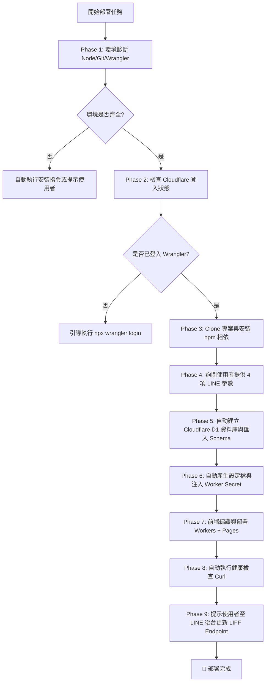

# 🚀 行農預約系統 · Agent 全自動化部署與技術規範懶人包
> **Target Audience**: 專門設計供 **AI Coding Agent**（如 Claude Code, Antigravity, Cursor, Devin, GitHub Copilot 等）讀取並自主執行，以最高自動化、最少使用者介入的方式完成專案檢測、建置與雲端部署。同時提供使用者必備之外部平台申請步驟。

---

## 📑 目錄
1. [Agent 執行指令與狀態流程圖](#1-agent-執行指令與狀態流程圖)
2. [技術規格與架構規範](#2-技術規格與架構規範)
3. [使用者前置準備（需人工操作清單）](#3-使用者前置準備需人工操作清單)
4. [Agent 自動化執行 SOP（逐步操作）](#4-agent-自動化執行-sop逐步操作)
5. [部署後驗證與設定收尾（含 Published 切換）](#5-部署後驗證與設定收尾)
6. [LINE 官方帳號（OA）整合與對外推廣指引](#6-line-官方帳號oa整合與對外推廣指引)
7. [常見問題與故障排除](#7-常見問題與故障排除)

---

## 1. Agent 執行指令與狀態流程圖


```mermaid
flowchart TD
    A[開始部署任務] --> B[Phase 1: 環境診斷 Node/Git/Wrangler]
    B --> C{環境是否齊全?}
    C -- 否 --> D[自動執行安裝指令或提示使用者]
    C -- 是 --> E[Phase 2: 檢查 Cloudflare 登入狀態]
    E --> F{是否已登入 Wrangler?}
    F -- 否 --> G[引導執行 npx wrangler login]
    F -- 是 --> H[Phase 3: Clone 專案與安裝 npm 相依]
    H --> I[Phase 4: 詢問使用者提供 4 項 LINE 參數]
    I --> J[Phase 5: 自動建立 Cloudflare D1 資料庫與匯入 Schema]
    J --> K[Phase 6: 自動產生設定檔與注入 Worker Secret]
    K --> L[Phase 7: 前端編譯與部署 Workers + Pages]
    L --> M[Phase 8: 自動執行健康檢查 Curl]
    M --> N[Phase 9: 提示使用者至 LINE 後台更新 LIFF Endpoint]
    N --> O[🎉 部署完成]
```

### 🤖 給 Agent 的重要指引
1. **盡可能自動化**：除「平台帳號註冊」與「取得 LINE 金鑰」需使用者手動提供外，環境檢查、依賴安裝、資料庫建立、檔案設定、建置與部署皆應由 Agent 透過終端機指令全自動完成。
2. **參數收集原則**：向使用者索取以下 4 個必要參數後即可啟動全自動部署流程：
   - `LINE_CHANNEL_ACCESS_TOKEN`（Messaging API 長效金鑰）
   - `ADMIN_NOTIFY_USER_ID`（接收通知的幹部 LINE User ID，以 `U` 開頭）
   - `LINE_LOGIN_CHANNEL_ID`（LINE Login Channel ID，數字）
   - `VITE_LIFF_ID`（LIFF 應用 ID，格式如 `2000000000-XXXXXXXX`）

---

## 2. 技術規格與架構規範

| 系統層級 | 技術選型 | 規格與責任 |
| :--- | :--- | :--- |
| **架構模式** | Monorepo | `packages/shared`, `packages/backend`, `packages/frontend` |
| **前端應用** | Cloudflare Pages | React 18, Vite, TypeScript, Tailwind CSS, Lucide React, `@line/liff` |
| **後端 API** | Cloudflare Workers | Hono 輕量高效框架, Node.js Compat, TypeScript, Web Crypto API |
| **資料庫** | Cloudflare D1 | 雲端分散式 Serverless SQLite，雙資料表 (`service_requests`, `blocked_dates`) |
| **身分驗證** | LINE OAuth ID Token | 後端呼叫 LINE 官方 `/oauth2/v2.1/verify` 驗證簽名，取得真實 `sub`（User ID） |
| **管理權限** | 幹部白名單 (`ADMIN_LINE_IDS`) | 僅限白名單 LINE 帳號登入管理後台，手機自動授權、桌機支援 QR Code 掃描 |
| **安全防護** | Cloudflare Turnstile | 表單前端零摩擦無感真人驗證，防止惡意腳本刷單與耗損 LINE 免費推播 |
| **頻率限制** | IP Sliding Window | 10 分鐘內最多 5 次送單，防止濫發攻擊；備援 PIN 碼連續錯誤 5 次鎖定 15 分鐘 |
| **營運成本** | 100% 免費額度支援 | Cloudflare 免費方案（Workers 10萬次/日 + Pages 無限頻寬 + D1 500萬次讀取/日）+ LINE 官方免費 200 則推播/月 |

---

## 3. 使用者前置準備（需人工操作清單）

請使用者依照以下 3 個步驟建立帳號並取得 4 個核心參數：

### 步驟 1：Cloudflare 帳號註冊與登入
1. 開啟 [Cloudflare 註冊頁面](https://dash.cloudflare.com/sign-up)。
2. 註冊帳號並完成電子郵件驗證。
3. （無需綁定信用卡，本專案完全運行於免費方案）。

---

### 步驟 2：LINE Developers 建立應用與取得金鑰
開啟 [LINE Developers Console](https://developers.line.biz/console/) 並登入個人 LINE 帳號。

#### 2-1 建立 Provider
- 若已有 Provider 可直接點入，若無請點擊 **Create a new provider**，輸入名稱（例如：`行農合作社`）。

#### 2-2 建立 Messaging API Channel（推播機器人）
1. 在 Provider 頁面點擊 **Create a new channel**，選擇 **Messaging API**。
2. 填寫名稱（例如：`高雄服務站預約助理`）、描述與類別後送出。
3. 進入該 Channel 頁面：
   - 點擊 **Messaging API** 分頁：
     - 滑至最下方找到 **Channel access token (long-lived)**，點擊 **Issue** 產生長效 Token。
     - 複製此 Token ➡️ **`LINE_CHANNEL_ACCESS_TOKEN`**。
   - 點擊 **Basic settings** 分頁：
     - 滑至最下方找到 **Your user ID**（以 `U` 開頭的 33 碼字串）。
     - 複製此 ID ➡️ **`ADMIN_NOTIFY_USER_ID`**。

#### 2-3 建立 LINE Login Channel 與 LIFF（農友表單與幹部登入）
1. 回到 Provider 頁面，點擊 **Create a new channel**，選擇 **LINE Login**。
2. 填寫名稱（例如：`行農服務站預約入口`），App types 勾選 **Web app**。
3. 建立後，在 **Basic settings** 分頁：
   - 找到 **Channel ID**（純數字）➡️ **`LINE_LOGIN_CHANNEL_ID`**。
4. 點擊 **LIFF** 分頁，點擊 **Add**：
   - **LIFF app name**：`預約申請表`
   - **Size**：選擇 `Full`
   - **Endpoint URL**：先暫填 `https://example.com`（待部署完成後再更新為真實 Pages 網址）
   - **Scopes**：勾選 `profile` 與 `openid`
   - **Bot prompt**：選擇 `Normal`
5. 點擊 **Add** 送出，在清單中複製 **LIFF ID**（格式如 `2011709076-xxxxxxxx`）➡️ **`VITE_LIFF_ID`**。

---

### 步驟 3：將取得的參數提供給 Agent
使用者請將下列資訊複製並填寫後，發送給 AI Agent：

```text
LINE_CHANNEL_ACCESS_TOKEN=（填入 Messaging API Channel Access Token）
ADMIN_NOTIFY_USER_ID=（填入以 U 開頭的個人 LINE User ID）
LINE_LOGIN_CHANNEL_ID=（填入 LINE Login Channel ID 數字）
VITE_LIFF_ID=（填入 LIFF ID）
STATION_NAME=高雄服務站（選填，預設為高雄服務站）
```

---

## 4. Agent 自動化執行 SOP（逐步操作）

> **Agent 執行環境要求**：Windows PowerShell / macOS Terminal / Linux Bash。

### Step 1: 環境檢查與自動安裝
Agent 執行以下指令檢查本機工具鏈：
```bash
node -v
npm -v
git --version
npx wrangler -v
```

- 若缺少 **Node.js**（需 >= 18.0.0）：
  - **Windows**: `winget install OpenJS.NodeJS.LTS`
  - **macOS**: `brew install node`
  - **Ubuntu/Debian**: `curl -fsSL https://deb.nodesource.com/setup_20.x | sudo -E bash - && sudo apt-get install -y nodejs`
- 若缺少 **Git**:
  - **Windows**: `winget install Git.Git`
  - **macOS**: `brew install git`

---

### Step 2: 檢查 Cloudflare 登入認證
Agent 執行指令：
```bash
npx wrangler whoami
```
- 若顯示 `You are not logged in.`，Agent 指導使用者於終端機執行：
```bash
npx wrangler login
```
（瀏覽器會自動彈出 Cloudflare 授權視窗，使用者點擊「Allow」授權即可完成）。

---

### Step 3: Clone 專案與安裝相依套件
Agent 執行：
```bash
git clone https://github.com/chingfonlee/biz-resource-reservation.git
cd biz-resource-reservation
npm install
```

---

### Step 4: Cloudflare D1 資料庫建立與 Schema 初始化
Agent 執行以下指令自動建立資料庫：
```bash
npx wrangler d1 create xingnong-db
```
- Agent 自動從終端機輸出中解析 `database_id = "xxxxxxxx-xxxx-xxxx-xxxx-xxxxxxxxxxxx"`。

Agent 執行資料庫結構初始化建表：
```bash
npx wrangler d1 execute xingnong-db --command "
CREATE TABLE IF NOT EXISTS service_requests (
  id TEXT PRIMARY KEY,
  created_at TEXT NOT NULL,
  updated_at TEXT NOT NULL,
  contact_name TEXT NOT NULL,
  phone TEXT NOT NULL,
  service_type TEXT NOT NULL,
  crop_type TEXT NOT NULL,
  area_size TEXT NOT NULL,
  area_value TEXT,
  area_unit TEXT,
  branch_volume TEXT,
  location_area TEXT NOT NULL,
  location_address TEXT NOT NULL,
  preferred_date TEXT NOT NULL,
  preferred_time_slot TEXT NOT NULL,
  date_flexibility TEXT,
  notes TEXT,
  status TEXT NOT NULL DEFAULT 'to_contact',
  admin_memo TEXT,
  line_user_id TEXT
);
CREATE TABLE IF NOT EXISTS blocked_dates (
  date TEXT PRIMARY KEY,
  reason TEXT,
  created_at TEXT NOT NULL
);
"
```

---

### Step 5: 設定檔與金鑰自動注入

#### 5-1 更新 `packages/backend/wrangler.toml`
Agent 將收集到的參數與上一步取得的 `database_id` 寫入 `packages/backend/wrangler.toml`：
```toml
name = "line-bot-farm-api"
main = "src/index.ts"
compatibility_date = "2024-09-23"
compatibility_flags = [ "nodejs_compat" ]

[[d1_databases]]
binding = "DB"
database_name = "xingnong-db"
database_id = "<REPLACE_WITH_DATABASE_ID>"

[vars]
STATION_NAME = "<REPLACE_WITH_STATION_NAME>"
ADMIN_NOTIFY_USER_ID = "<REPLACE_WITH_ADMIN_NOTIFY_USER_ID>"
ADMIN_LINE_IDS = "<REPLACE_WITH_ADMIN_NOTIFY_USER_ID>"
LINE_LOGIN_CHANNEL_ID = "<REPLACE_WITH_LINE_LOGIN_CHANNEL_ID>"
TURNSTILE_SECRET_KEY = "1x0000000000000000000000000000000AA"
ADMIN_PIN = "20241718"
```

#### 5-2 注入 LINE Messaging Access Token 至 Worker Secret
Agent 於 `packages/backend` 執行：
```bash
cd packages/backend
echo "<REPLACE_WITH_LINE_CHANNEL_ACCESS_TOKEN>" | npx wrangler secret put LINE_CHANNEL_ACCESS_TOKEN
cd ../..
```

#### 5-3 寫入前端 `.env`
Agent 建立 `packages/frontend/.env`：
```env
VITE_LIFF_ID=<REPLACE_WITH_VITE_LIFF_ID>
VITE_TURNSTILE_SITE_KEY=1x00000000000000000000AA
```

---

### Step 6: 前端編譯建置
Agent 於專案根目錄執行：
```bash
npm run build:frontend
```
確認輸出 `dist/index.html` 產生且建置無報錯。

---

### Step 7: 雲端部署

#### 7-1 部署後端 API (Cloudflare Worker)
Agent 執行：
```bash
cd packages/backend
npx wrangler deploy
cd ../..
```
- 部署完成後，記下終端機輸出的 Worker 網址（例如 `https://line-bot-farm-api.<your-account>.workers.dev`）。

#### 7-2 部署前端 (Cloudflare Pages)
Agent 執行：
```bash
cd packages/frontend
npx wrangler pages deploy dist --project-name xingnong-farm --commit-dirty=true
cd ../..
```
- 部署完成後，記下終端機輸出的 Pages 正式網址（例如 `https://xingnong-farm.pages.dev`）。

---

## 5. 部署後驗證與設定收尾

### 驗證 1：後端健康檢查 (API Health Check)
Agent 自動執行連線測試：
```bash
curl -s https://<YOUR_PAGES_DOMAIN>/api/health
```
若回傳包含 `{"status":"ok","station":"..."}` 即表示前端 Pages Proxy 與後端 Workers API 連線正常！

### 驗證 2：更新 LIFF Endpoint URL
Agent 向使用者提示：
> 📢 **步驟 A：請回 LINE Developers 綁定網址**
> 1. 開啟 [LINE Developers Console](https://developers.line.biz/console/)。
> 2. 進入先前建立的 **LINE Login Channel** ➡️ **LIFF** 標籤。
> 3. 點擊進入您的 LIFF App，將 **Endpoint URL** 修改為剛才部署完成的 Pages 網址：
>    `https://<YOUR_PAGES_DOMAIN>`（例如 `https://xingnong-farm.pages.dev`）。
> 4. 點擊 **Update** 儲存。

### 驗證 3：將 LINE Login 頻道切換為 Published（開放給一般大眾）
> 🚨 **關鍵步驟：若未切換，外部一般用戶將無法開啟 LIFF！**
> - **原因**：LINE 平台新建立的 Channel 預設皆為 **`Developing`（開發中）** 狀態。在開發中狀態下，**只有頻道擁有者或在「Roles」內的使用者可以開啟**；其他一般用戶開啟時會出現「此服務目前正在開發中 / 無法使用」錯誤。
> - **操作方式**：
>   1. 在 [LINE Developers Console](https://developers.line.biz/console/) 點進您的 **LINE Login Channel**。
>   2. 查看頁面最頂部、頻道名稱旁邊的狀態膠囊標籤。
>   3. 將 **`Developing`** 點擊並切換為 **`Published`**。
>   4. 切換後，任何一般 LINE 使用者點擊您的 LIFF 連結皆能順暢開啟並預約！

---

## 6. LINE 官方帳號（OA）整合與對外推廣指引

當系統部署完成並切換為 `Published` 後，您可以透過以下方式讓農友快速進入預約表單：

### 1. 取得農友專用 LIFF 連結
在 LINE Developers 的 LIFF 分頁中，複製 **LIFF URL**，格式如下：
```text
https://liff.line.me/<YOUR_LIFF_ID>
```
（在 LINE 聊天室中點擊此連結，會直接在手機以原生全螢幕 Webview 開啟，體驗極佳）。

### 2. 放置於官方帳號「圖文選單」(Rich Menu)
1. 登入 [LINE Official Account Manager (官方帳號管理後台)](https://manager.line.biz/)。
2. 進入 **聊天室管理** ➡️ **圖文選單** ➡️ 點擊 **建立圖文選單**。
3. 上傳選單背景圖，將其中一格動作類型設定為 **連結**。
4. 網址填入您的 **`https://liff.line.me/<YOUR_LIFF_ID>`**。
5. 儲存並發布後，所有加入官方帳號的農民只要點擊聊天室底部的圖文按鈕，就能一秒喚起預約表單！

### 3. 設定「加入好友歡迎訊息」
在官方帳號後台設定：
> 「歡迎加入！若您有果樹枝條粉碎、代耕或農機租借需求，請點擊下方連結立即預約：
> https://liff.line.me/<YOUR_LIFF_ID>」

### 4. LINE Messaging API 每月免費推播額度說明
- **免費配額**：LINE 官方提供所有帳號每個月 **200 則免費 Push 訊息**。
- **扣額時機**：每當有農友送出一筆申請單，系統會發送 **1 則 Flex Message 推播通知** 給幹部的 LINE，因此每個月前 200 筆預約的通知完全免費。
- **額度超出保護**：若單月超過 200 筆，LINE 推播雖會暫停，但 **Cloudflare D1 資料庫依然 100% 完整保存每一筆預約**，幹部依然可直接進入後台（`/?view=admin`）查看所有新進案件。

---

## 7. 常見問題與故障排除

| 問題情境 | 排查與修復方式 |
| :--- | :--- |
| **管理後台顯示 403 Forbidden（未獲幹部授權）** | 代表當前登入的 LINE 帳號不在白名單中。請將該使用者的 LINE ID 加入 `packages/backend/wrangler.toml` 的 `ADMIN_LINE_IDS`（逗號隔開），並重新執行 `npx wrangler deploy`。 |
| **農民送出表單後，LINE 未收到推播訊息** | 1. 檢查 `packages/backend` 是否已成功執行 `wrangler secret put LINE_CHANNEL_ACCESS_TOKEN`。<br>2. 檢查 `ADMIN_NOTIFY_USER_ID` 是否與欲接收通知的 LINE 帳號一致。<br>3. 確保管理者已加入該 LINE 官方帳號為好友。 |
| **LIFF 開啟時畫面空白或提示 URL 不合法** | 確認 LINE Developers 後台 LIFF 的 **Endpoint URL** 是否完全匹配 Cloudflare Pages 網址（包含 `https://`，不可有多餘斜線）。 |
| **更換正式 Cloudflare Turnstile 金鑰** | 前往 [Cloudflare Dashboard](https://dash.cloudflare.com/) 點選 **Turnstile** 建立 Site，取得 Site Key（填入前端 `VITE_TURNSTILE_SITE_KEY`）與 Secret Key（填入後端 `wrangler.toml` 之 `TURNSTILE_SECRET_KEY`）後重新 deploy。 |
