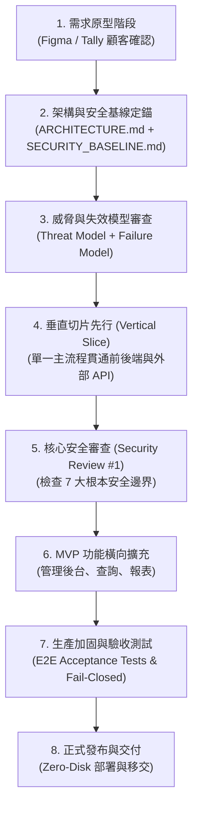

# 🚀 AI Agent 協同標準開發程序 (Development SOP & Lifecycle)

> **前言**：本指南總結本專案在 Serverless、LINE Bot、Cloudflare D1/Pages 與 Turnstile 自動化部署中多次迭代的資安加固經驗。  
> 目的在於提供一套**可重複複製、高效且兼顧高安全性**的標準開發生命週期（Lifecycle），適用於未來的 LINE 預約、電商購物、打卡簽到、客服機器人等微型與中小企業系統。

---

## 🧭 核心思維轉變：從「事後補漏洞」到「基線前置 + 垂直切片」

在過去的開發模式中，常見的問題是：功能與原型迅速完成，但到了部署與上線階段，才發現 **Secret 管理落地、第三方 Webhook 偽造、錯誤訊息洩漏、腳本重複執行堆疊孤兒資源、以及 API 斷網時盲目放行（Fail-Open）** 等根本性問題，導致架構反覆大改。

### 💡 關鍵原則：
1. **不要一開始就把所有資安做到企業極致，但必須把「後面改會很痛」的決策前置**。
2. **在功能原型確認後，一次把「技術架構 + 安全基線 + 失效模型 + 上線條件」一起定下來**。
3. **不只問「正常情況怎麼跑」，固定追問「系統故障與惡意攻擊時怎麼辦」**。

---

## 🔄 8 階段標準開發生命週期 (The 8-Stage Lifecycle)

---

### 階段 1：需求原型確認（Prototype & Requirements）
- **工具**：Figma、Tally、Draw.io 或文字規格。
- **目標**：讓顧客確認「流程對不對、體驗好不好」。
- **重點檢核**：
  - 釐清角色（例如：一般農民 vs 站點管理員）。
  - 釐清資料欄位（需要填什麼、長度合理範圍）。
  - 釐清資料能見度（誰能看見他人資料？商家看到什麼？農民看到什麼？）。
  - 釐清不可逆動作（例如：取消預約後能否恢復？預約單能否直接刪除？）。
  > ⚠️ **此階段先不急著談技術選型**，專注於業務邏輯與顧客價值。

---

### 階段 2：架構與安全基線定錨（Architecture & Security Baseline）
- **交付成果**：Agent 同步產出 `ARCHITECTURE.md` 與 `SECURITY_BASELINE.md`（一至兩頁即可）。
- **目標**：劃清信任邊界（Trust Boundary），決定最低不可違反規則。
- **關鍵決策項目**：
  - **資料流向**：`Client ➔ API ➔ Auth ➔ DB ➔ Third-party API`。
  - **身分驗證（Authentication）**：伺服器驗簽（如 LINE Login ID Token），**前端不傳遞亦不信任靜態 User ID**。
  - **授權機制（Authorization）**：後端白名單驗證（`ADMIN_LINE_IDS`）。
  - **憑證託管（Secret Management）**：採用 **Zero-Disk** 原則，所有 Secret 只存於雲端 Vault/Worker Secret，絕不進 Git、`.env` 或硬編碼。
  - **個資定義（PII）**：標記電話、姓名、地址等欄位，日誌輸出必須自動脫敏。
  - **錯誤回傳規範**：對外錯誤全面代碼化與泛化，禁止將 SQL 或內部 Exception 直傳前端。

---

### 階段 3：雙模型檢核（Threat Model + Failure Model）
在正式動工寫扣前，與 Agent 進行一輪雙模型問答：

#### 🔹 威脅模型（Threat Model）——「有人故意亂搞會怎樣？」
1. 有人偽造 Webhook 假通知怎麼辦？ ➔ **HMAC-SHA256 恆定時間比對驗簽**。
2. 有人故意用腳本灌單爆發預約怎麼辦？ ➔ **Turnstile 真人檢核 + 複合限流 (Rate Limiting)**。
3. 有人發送超大畸形封包怎麼辦？ ➔ **全站 32KB bodyLimit 攔截 + 欄位長度上限防呆**。

#### 🔹 失效模型（Failure Model）——「沒人攻擊，但系統壞掉或重跑會怎樣？」
1. 外部 API（如 Cloudflare / LINE）回傳 500 或斷網怎麼辦？ ➔ **堅持 Fail-Closed（安全阻斷），絕不 Fail-Open 降級放行**。
2. Agent 或部署腳本重跑第二次怎麼辦？ ➔ **腳本必須具備三層冪等性（Idempotency），絕不產生孤兒重複資源**。
3. 雲端 Secret 意外丟失怎麼辦？ ➔ **自動化流程具備 Self-Healing（自我修復）同步機制**。
4. 第三方 CLI 報錯怎麼辦？ ➔ **記憶體緩衝隔離，白名單脫敏日誌，防範 raw error / token 洩漏**。

---

### 階段 4：垂直切片先行 (Vertical Slice First)
- **原則**：**絕不要一次把全套功能全部寫完才開始測**。
- **實作方式**：
  - 挑選最核心的一條端對端路徑：  
    `LINE 授權 ➔ 填寫 1 筆預約 ➔ 後端驗證 ➔ 寫入 D1 資料庫 ➔ 發送 LINE 推播通知`
  - 這一小條從前端打到資料庫與外部 API，**第一天就完全依照 Security Baseline 的規範寫**。
- **好處**：及早驗證 Auth 驗簽、Token 生命週期、資料庫連線與安全標頭，基礎打穩後擴充邊界功能的成本極低。

---

### 階段 5：第一次核心安全審查 (Security Review #1)
當垂直切片打通、尚未擴充大量商業邏輯前，執行核心安全檢核：

- [ ] **身分是否由伺服器端確認？**（有無任何依賴前端傳入 userId 的洞？）
- [ ] **權限是否在 Server 強制生效？**（管理員路由是否有白名單攔截？）
- [ ] **Secret 是否可能落地？**（檢查本機是否有殘留含 Secret 的檔案？）
- [ ] **外部 API 失敗時會 Fail-Open 嗎？**（模擬斷網，確認是否安全阻斷？）
- [ ] **重試會不會產生重複資源？**（重複執行部署腳本，檢查雲端資源是否穩定復用？）
- [ ] **日誌是否印出 PII 或 Token？**（檢查後端與前端 console 輸出）
- [ ] **第三方 CLI 的 stdout/stderr 是否會洩漏？**（確認子程序無 `shell: true` 且輸出經白名單過濾）

---

### 階段 6：功能橫向擴展 (MVP Completion)
在穩固的安全核心基石上，快速擴充剩餘業務功能：
- 服務站管理員後台（審核、備註、改期、封鎖日期）。
- 農民歷史預約查詢與進度卡片回傳。
- 資料篩選、分頁與匯出。

---

### 階段 7：生產加固與驗收測試 (Production Hardening & E2E Tests)
在準備正式對外開放前，執行上線驗收：
- **5 大端對端情境實測**：
  1. 乾淨環境首次部署與金鑰配置。
  2. 二次執行確認 100% 冪等復用。
  3. 模擬 Secret 遺失之自我修復（Self-Healing）。
  4. 模擬資源遭外部刪除時之受控重建。
  5. 斷網與 API 失敗時之 Fail-Closed 阻斷。
- **Turnstile 正式切換**：從測試 Key 平滑切換為生產 Managed 專屬金鑰。
- **LINE 官方帳號設定**：切換 LINE Login 為 `Published`、開啟 Webhook 與圖文選單綁定。

---

### 階段 8：正式發布與移交 (Release & Handoff)
- 產出乾淨清晰的 [DEPLOYMENT_GUIDE.md](file:///c:/Users/user/claudecode/open-booking-line/DEPLOYMENT_GUIDE.md) 與 [BEGINNER_GUIDE.md](file:///c:/Users/user/claudecode/open-booking-line/BEGINNER_GUIDE.md)。
- 建立公開版本去識別化導出腳本（`npm run export:opensource`），保證交付時的隱私合規。

---

## 📁 未來專案建議具備的「4 份微型核心文件」

未來任何新專案開案時，建議請 Agent 在一開始維護這 4 份簡潔的文件（每份 1~2 頁即可，避免過度設計）：

| 文件名稱 | 檔案定位 | 核心內容 |
| :--- | :--- | :--- |
| **`PRD.md`** | 顧客到底要什麼 | 業務目標、使用者角色、主要功能流程、資料欄位清單 |
| **`ARCHITECTURE.md`** | 系統怎麼組裝 | 系統架構圖、資料流、技術選型、模組切分、雲端基礎架構 |
| **`SECURITY_BASELINE.md`** | 哪些規則絕對不能破 | 10 大不可違反基線、信任邊界、威脅模型、失效模型 |
| **`ACCEPTANCE_TESTS.md`** | 怎樣才算真的完成 | 核心業務場景、邊界條件、Fail-Closed 驗收情境、自我修復檢查項 |
