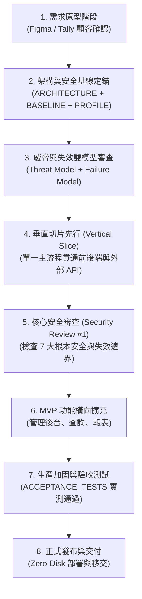

# 🚀 AI Agent 協同標準開發程序 (Development SOP & Lifecycle)

> **前言**：本指南總結本專案在 Serverless、LINE Bot、Cloudflare D1/Pages 與 Turnstile 自動化部署中多次迭代的資安加固經驗。  
> 目的在於提供一套**可重複複製、高韌性且兼顧高安全性**的標準開發生命週期（Lifecycle），適用於未來的 LINE 預約、電商購物、打卡簽到、POS、客服機器人或一般 Web SaaS 等系統。

---

## 🧭 核心思維轉變：從「事後補漏洞」到「雙層治理 + 垂直切片」

在過去的開發模式中，常見的問題是：功能與原型迅速完成，但到了部署與上線階段，才發現 **Secret 管理落地、第三方 Webhook 偽造、錯誤訊息洩漏、腳本重複執行堆疊孤兒資源、以及 API 斷網時盲目放行（Fail-Open）** 等根本性問題，導致架構反覆大改。

### 💡 關鍵原則：
1. **雙層文件架構 (Two-Tier Architecture)**：
   - **通用工程原則層 (`SECURITY_BASELINE.md`)**：定義跨平臺、語言無關的 10 大不可妥協原則。
   - **專案實作設定層 (`SECURITY_PROFILE.md`)**：定義當前專案特定技術棧（如 Cloudflare, LINE, Hono）之具體落地參數。更換技術棧時只換 Profile，不改 Baseline。
2. **在功能原型確認後，一次把「技術架構 + 安全基線 + 雙模型 + 驗收條件」一起定下來**。
3. **區分關鍵依賴與非關鍵副作用**：資安關鍵（Auth/Captcha）嚴格 Fail-Closed；非關鍵副作用（通知/日誌）安全降級並非同步重試。
4. **正確認知邊界防禦**：CORS 僅為瀏覽器隔離，API 安全必須依賴伺服器端鑑權、限流與真人檢核。
5. **雙層冪等性 (Dual-Layer Idempotency)**：基礎設施具備重複執行之復用更新能力；業務邏輯具備防止重放與重複送單之約束。

---

## 🔄 8 階段標準開發生命週期 (The 8-Stage Lifecycle)



---

### 階段 1：需求原型確認（Prototype & Requirements）
- **工具**：Figma、Tally、Draw.io 或文字規格。
- **目標**：讓顧客確認「流程對不對、體驗好不好」。
- **重點檢核**：
  - 釐清角色（例如：一般使用者 vs 站點管理員）。
  - 釐清資料欄位（需要填什麼、長度合理範圍）。
  - 釐清資料能見度（誰能看見他人資料？管理者看到什麼？客戶看到什麼？）。
  - 釐清不可逆動作（例如：取消預約後能否恢復？單據能否直接物理刪除？）。
  > ⚠️ **此階段先不急著談技術選型**，專注於業務邏輯與顧客價值。

---

### 階段 2：架構與安全基線定錨（Architecture & Baseline Anchor）
- **交付成果**：Agent 同步產出或確認 `ARCHITECTURE.md`、`SECURITY_BASELINE.md` 與 `SECURITY_PROFILE.md`。
- **目標**：劃清信任邊界（Trust Boundary），將通用基線對齊至本專案實作。
- **關鍵決策項目**：
  - **資料流向與邊界**：`Client ➔ API ➔ Auth ➔ DB ➔ Third-party API`。
  - **身分驗證（Authentication）**：伺服器驗簽（如官方 ID Token），**前端不傳遞亦不信任靜態 User ID**。
  - **授權機制（Authorization）**：後端嚴格校驗權限角色白名單。
  - **憑證託管（Secret Management）**：落實 **Zero-Disk**，所有 Secret 只存於雲端 Secret Manager / Worker Secrets，絕不進 Git、`.env`、配置檔或日誌。
  - **個資定義（PII）**：標記電話、姓名、地址等欄位，日誌輸出必須自動脫敏。
  - **錯誤回傳規範**：對外錯誤全面代碼化與語意泛化，禁止將 SQL 或內部 Exception 直傳前端。

---

### 階段 3：雙模型審查（Threat Model + Failure Model）
在正式動工寫扣前，與 Agent 進行一輪雙模型問答：

#### 🔹 威脅模型（Threat Model）——「有人故意亂搞會怎樣？」
1. **身分冒用**：有人隨意捏造別人的 User ID 怎麼辦？ ➔ **伺服器公鑰驗簽，禁止前端傳遞 User ID**。
2. **跨域發起惡意請求**：
   - 瀏覽器端 ➔ **CORS 白名單隔離**。
   - 非瀏覽器端（curl、Postman、腳本） ➔ **複合限流 + 真人檢核 + 簽章驗證**。
3. **巨量封包攻擊**：有人傳入 10MB 畸形字串怎麼辦？ ➔ **API 閘道限制 Body 大小（如 32KB）+ 欄位 Schema 上限**。
4. **重複提交與重放**：有人短時間連點送出兩次怎麼辦？ ➔ **業務冪等設計（唯一鍵約束 / Idempotency Key），不能只依賴 UI 按鈕 Disable**。

#### 🔹 失效模型（Failure Model）——「沒人攻擊，但系統出錯或重跑會怎樣？」
1. **資安關鍵服務異常（Auth / Captcha）**：驗證服務 500 或斷網 ➔ **堅持 Fail-Closed（安全阻斷），絕不降級盲目放行**。
2. **非關鍵副作用異常（LINE 推播 / Email / 數據分析）**：
   - 若主交易（如資料庫寫入）已成功，發訊 API 異常 ➔ **安全降級（記錄警告並交由重試機制處理），絕不回滾已成立的主交易**。
3. **自動化部署腳本重跑**：網路中斷後跑第二次怎麼辦？ ➔ **腳本必須具備三層冪等性（Idempotency），自動復用或同步，絕不堆疊孤兒資源**。
4. **雲端 Secret 意外丟失**： ➔ **自動化流程具備 Self-Healing（自我修復）提取並同步機制**。

---

### 階段 4：垂直切片先行 (Vertical Slice First)
- **原則**：**絕不要一次把全套功能全部寫完才開始測**。
- **實作方式**：
  - 挑選最核心的一條端對端路徑：  
    `使用者登入 ➔ 送出 1 筆核心交易 ➔ 後端驗簽 ➔ 寫入資料庫 ➔ 觸發非同步通知`
  - 這一小條從前端打到資料庫與外部 API，**第一天就完全依照 Security Baseline 的規範寫**。
- **好處**：及早驗證 Auth 驗簽、Token 生命週期、資料庫連線與安全標頭，基礎打穩後擴充邊界功能的成本極低。

---

### 階段 5：第一次核心安全審查 (Security Review #1)
當垂直切片打通、尚未擴充大量商業邏輯前，執行核心檢核：

- [ ] **身分是否由伺服器端確認？**（有無任何依賴前端傳入 userId 的漏洞？）
- [ ] **權限是否在 Server 強制生效？**（後台路由是否有白名單攔截？）
- [ ] **Secret 是否可能落地？**（檢查本機是否有殘留含 Secret 的檔案？）
- [ ] **資安依賴是否 Fail-Closed？**（模擬驗證斷網，確認是否安全阻斷？）
- [ ] **非關鍵依賴是否安全降級？**（模擬通知失敗，確認主交易不被回滾？）
- [ ] **重試會不會產生重複資源？**（重複執行部署腳本，檢查雲端資源是否穩定復用？）
- [ ] **日誌是否印出 PII 或 Token？**（檢查後端與前端 console 輸出）
- [ ] **第三方 CLI 的 stdout/stderr 是否會洩漏？**（確認子程序無 `shell: true` 且輸出經白名單過濾）

---

### 階段 6：功能橫向擴展 (MVP Completion)
在穩固的安全核心基石上，快速擴充剩餘業務功能：
- 服務站管理員後台（審核、備註、改期、封鎖日期）。
- 歷史記錄查詢與進度卡片回傳。
- 資料篩選、分頁與匯出。

---

### 階段 7：生產加固與驗收測試 (Production Hardening & E2E Tests)
在準備正式對外開放前，執行 [`ACCEPTANCE_TESTS.md`](ACCEPTANCE_TESTS.md) 中的各項情境實測：
- **業務功能驗收**：主流程、查詢、後台操作完整驗收。
- **邊界防護驗收**：未授權阻斷、偽造簽章阻斷、超大封包攔截、頻率限制觸發。
- **基礎設施 5 大 E2E 驗收**：首次部署、二次復用、Secret 自我修復、遠端刪除重整、斷網安全阻斷。
- **金鑰正式切換**：從測試 Key 平滑切換為專屬生產金鑰。

---

### 階段 8：正式發布與移交 (Release & Handoff)
- 產出乾淨清晰的 [DEPLOYMENT_GUIDE.md](DEPLOYMENT_GUIDE.md) 與 [BEGINNER_GUIDE.md](BEGINNER_GUIDE.md)。
- 建立公開版本去識別化導出腳本（`npm run export:opensource`），保證交付時的隱私合規。

---

## 📁 新專案推薦標準文件結構 (Future Project Blueprint)

未來任何新專案開案時，建議直接套用以下目錄骨幹：

```text
my-new-project/
├── AGENTS.md               # 🤖 AI Agent 進入專案的第 1 讀取規範（頂層入口）
├── PRD.md                  # 🎯 顧客到底要什麼（需求、欄位、流程）
├── ARCHITECTURE.md         # 🏗️ 系統怎麼組裝（架構圖、資料流、技術棧）
├── SECURITY_BASELINE.md    # 🛡️ 哪些通用規則絕對不能破（跨平臺抽象基線）
├── SECURITY_PROFILE.md     # 🔐 本專案具體如何落實基線（專案特定技術實作）
├── ACCEPTANCE_TESTS.md     # ✅ 怎樣才算真的完成（客觀驗收情境清單）
├── DEVELOPMENT_SOP.md      # 🚀 8 階段開發生命週期指引
├── packages/ 或 src/       # 💻 原始碼實作
└── docs/                   # 📚 架構決策記錄 (ADR) 與威脅模型細節
```
