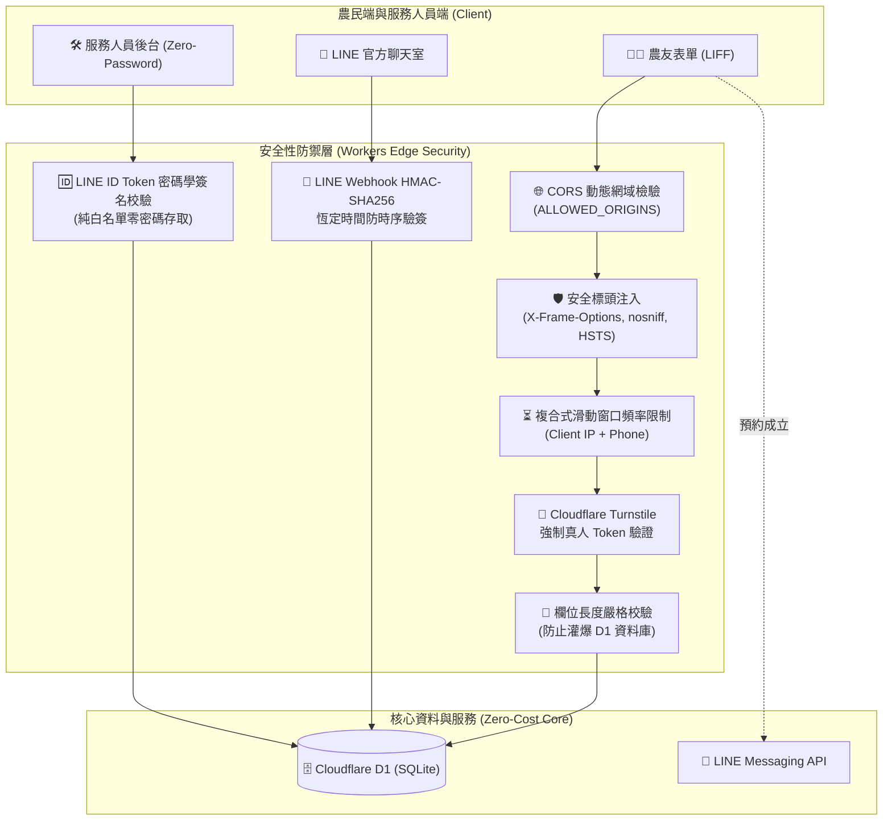

# 🌱 行農合作社 · 農業資源預約管理系統 (Open Source Starter)

全純文字輕量化、高效能且安全嚴謹的農業與在地資源預約管理系統。基於 **Cloudflare Serverless（Workers + D1 + Pages）** 與 **LINE LIFF** 架構打造，無需負擔高昂伺服器與資料庫月租費，全案皆可在 Cloudflare 與 LINE 免費額度內極速運行。

> 🌾 **完全新手 / 零程式基礎 5 分鐘架站懶人包**：請直接參閱 **[新手白話圖文部署指南 (BEGINNER_GUIDE.md)](BEGINNER_GUIDE.md)**，跟著圖解複製 5 個代碼交給 AI 即可全自動完成架設！  
> 🤖 **AI Coding Agent / 開發者自動化 SOP**：請參閱 **[Agent 全自動化部署手冊 (DEPLOYMENT_GUIDE.md)](DEPLOYMENT_GUIDE.md)**，內含環境自動檢測、Cloudflare D1 初始化、金鑰配置與全自動發布之 SOP。

---

## 🌟 核心特色

1. **極致輕量與低營運成本**
   - 捨棄笨重高耗能的照片上傳與物件儲存（R2 / S3），聚焦於農民最核心的田區資訊、作物面積、枝條體積與希望施工時程。
   - 全無伺服器（Serverless）架構，零冷啟動延遲，單次預約送出僅需數十毫秒。
2. **LINE 原生流暢體驗**
   - 農民開啟 LINE LIFF 即可自動帶入暱稱，一鍵完成預約。
   - 預約送出後，站所服務人員即刻收到美觀的 **LINE Flex Message** 推播通知，並可直接點擊卡片撥號聯絡農民或一鍵進入後台。
3. **開源級企業安全防護體系**
   - 🛡️ **純 LINE 服務人員白名單原生鑑權（Zero-Password 零密碼架構）**：管理後台全面採用 LINE 官方 ID Token 驗證，僅允許設定在 `ADMIN_LINE_IDS` 白名單內的服務人員存取。手機端自動授權進入，電腦桌機端支援 QR Code 掃描登入；**徹底拔除靜態密碼，徹底根除密碼洩漏、爆破與忘記密碼之風險**。
   - 🛡️ **LINE Webhook 密碼學防偽驗簽**：採用原生 Web Crypto API 針對 `x-line-signature` 進行 HMAC-SHA256 恆定時間驗證，杜絕偽造 Webhook 事件盜刷 DB 或耗損推播配額。
   - 🛡️ **Cloudflare Turnstile 強制無感真人驗證**：農民填表無須辨識歪斜文字，背景強制驗核 Token，防禦惡意機器人繞過刷單、保護每月免費 LINE 推播額度與 D1 寫入資源。
   - 🛡️ **全資料欄位長度防爆破與 PII 日誌脫敏**：全面限制姓名、電話、地址與備註之最大字數，日誌自動遮蔽敏感個人電話，落實隱私合規。
   - 🛡️ **開箱即測與正式上線加固指引**：預設配備零門檻本機測試容錯，正式投入營運時請參閱 [部署手冊 5.1 節 (DEPLOYMENT_GUIDE.md)](DEPLOYMENT_GUIDE.md#--51--正式營運安全加固-check-list3-步驟無痛升級生產環境) 完成 2 分鐘快速加固。

---

## 📁 專案架構 (Monorepo)

```text
open-booking-line/
├── packages/
│   ├── shared/            # 雙端共用 TypeScript 型別與常數定義
│   │   └── types.ts
│   ├── backend/           # Cloudflare Workers 後端 API (採用 Hono 框架)
│   │   ├── src/
│   │   │   ├── index.ts   # 路由控制、頻率限制、安全驗證中間件
│   │   │   ├── line.ts    # LINE Flex Message 產生器、Push API、ID Token 驗證
│   │   │   └── turnstile.ts # Cloudflare Turnstile 站點真人校驗模組
│   │   └── wrangler.toml  # Cloudflare Worker 佈署與環境變數綁定檔
│   └── frontend/          # Cloudflare Pages 前端 (React + Vite + Tailwind CSS)
│       ├── functions/     # Cloudflare Pages Functions (API 代理轉發)
│       └── src/
│           ├── components/
│           │   ├── ApplyForm.tsx      # 農友預約表單 (含 Turnstile 與 LINE 身分綁定)
│           │   └── AdminDashboard.tsx  # 幹部管理後台 (支援 LINE 登入與電話一鍵撥號)
│           └── App.tsx
├── scripts/
│   └── verify-no-photo.js # 輕量版純文字架構相依性自動校驗腳本
├── .env.example           # 環境變數範本檔
└── README.md
```

---

## 🚀 快速開始

### 1. 取得專案並安裝相依套件

```bash
git clone https://github.com/chingfonlee/open-booking-line.git
cd open-booking-line
npm install
```

### 2. 初始化 Cloudflare D1 資料庫

登入 Cloudflare CLI 並建立 D1 資料庫：
```bash
npx wrangler login
npx wrangler d1 create xingnong-db
```
將終端機輸出的 `database_id` 填寫至 `packages/backend/wrangler.toml` 中的 `[[d1_databases]]` 區塊。

執行資料表建立：
```bash
npx wrangler d1 execute xingnong-db --command "
CREATE TABLE IF NOT EXISTS service_requests (
  id TEXT PRIMARY KEY,
  created_at TEXT NOT NULL,
  updated_at TEXT NOT NULL,
  contact_name TEXT NOT NULL,
  phone TEXT NOT NULL,
  service_type TEXT NOT NULL,
  crop_type TEXT NOT NULL,
  area_size TEXT NOT NULL,
  area_value TEXT,
  area_unit TEXT,
  branch_volume TEXT,
  location_area TEXT NOT NULL,
  location_address TEXT NOT NULL,
  preferred_date TEXT NOT NULL,
  preferred_time_slot TEXT NOT NULL,
  date_flexibility TEXT,
  notes TEXT,
  status TEXT NOT NULL DEFAULT 'to_contact',
  admin_memo TEXT,
  line_user_id TEXT
);
CREATE TABLE IF NOT EXISTS blocked_dates (
  date TEXT PRIMARY KEY,
  reason TEXT,
  created_at TEXT NOT NULL
);
"
```

### 3. 設定環境變數與金鑰

參考 `.env.example` 與 `packages/backend/wrangler.toml.example`，在 `packages/backend/wrangler.toml` 填寫以下設定：

| 變數名稱 | 說明 | 範例值 / 建議設定 |
| :--- | :--- | :--- |
| `STATION_NAME` | 服務站所名稱 | `高雄服務站`（開源範例：`示範農場服務站`） |
| `ADMIN_NOTIFY_USER_ID` | 接收預約推播通知的服務人員 LINE User ID | `Uxxxxxxxxxxxxxxxxxxxxxxxxxxxxxxxx` |
| `ADMIN_LINE_IDS` | 授權管理服務人員的 LINE User ID 白名單（逗號分隔） | `Uxxxxxxxxxxxxxxxxxxxxxxxxxxxxxxxx,U123456...` |
| `LINE_LOGIN_CHANNEL_ID` | LIFF 所屬的 LINE Login Channel ID | `2000000000` |
| `ALLOWED_ORIGINS` | 前端允許之 CORS 來源（逗號分隔） | `https://your-app.pages.dev,https://*.pages.dev` |

將關鍵密鑰設為 Worker Secret（絕不寫入檔案，避免納入版本控制）：
```bash
cd packages/backend
# 1. LINE Messaging API Channel Access Token (必填，用於發送通知與查詢進度)
npx wrangler secret put LINE_CHANNEL_ACCESS_TOKEN

# 2. LINE Messaging API Channel Secret (強烈推薦，用於 Webhook HMAC-SHA256 驗簽)
npx wrangler secret put LINE_CHANNEL_SECRET

# 3. Cloudflare Turnstile 密鑰 (非必填，預設走測試金鑰；正式環境推薦執行 npm run setup:turnstile 自動配置，或手動安全寫入)
npx wrangler secret put TURNSTILE_SECRET_KEY
```

### 4. 部署至 Cloudflare

#### 部署後端 API (Cloudflare Worker)
```bash
cd packages/backend
npx wrangler deploy
```

#### 部署前端介面 (Cloudflare Pages)
```bash
cd ../frontend
npm run build
npx wrangler pages deploy dist --project-name xingnong-farm
```

---

## 🔒 企業級安全性架構與已修復項目說明 (Security Hardening)

本專案經過嚴謹的安全審計與重構，全面解決了常見的 Serverless 與 LINE Bot 部署資安漏洞，具備以下 8 重防護機制：



### 1. 🛡️ LINE Webhook 原生 HMAC-SHA256 恆定時間防偽驗簽
* **修復漏洞**：傳統 Webhook 缺乏簽名校驗，且字串 `===` 比對存在時序微秒差異（Timing Attack）。
* **防護機制**：實作 [`verifyLineSignature`](packages/backend/src/line.ts)，透過原生 Web Crypto API 計算 `x-line-signature` 之 HMAC-SHA256 雜湊，並採用 `constantTimeEqual` 恆定時間比對，阻斷偽造請求與時序攻擊。

### 2. 🔐 純 LINE 身分白名單鑑權（Zero-Password 零密碼架構）
* **修復漏洞**：靜態管理密碼（PIN）容易被暴力破解、洩漏於 Git，或儲存於 `localStorage` 遭 XSS 竊取。
* **防護機制**：**徹底拔除所有 PIN 碼相關機制**。管理端 100% 透過 LINE 官方 ID Token 驗證服務人員身分（`ADMIN_LINE_IDS`），手機端免密碼自動鑑權、電腦端手機掃碼登入，無密碼可供洩漏或爆破。

### 3. 🤖 Cloudflare Turnstile 強制真人檢核（防範繞過漏洞）
* **修復漏洞**：舊版本若客戶端未帶 `turnstile_token` 欄位即直接放行，容易被腳本繞過。
* **防護機制**：後端強制要求 `body.turnstile_token` 必填，否則直接回傳 HTTP 400，徹底封死無 Token 繞過途徑。

### 4. 📏 資料庫全欄位長度上限防禦 (Anti-Blowup)
* **修復漏洞**：SQLite/D1 的 `TEXT` 預設不限長度，惡意攻擊者若塞入大量垃圾字串（數十萬字）可能癱瘓資料庫。
* **防護機制**：嚴格限制所有字串長度：姓名 $\le 50$ 字、電話 $\le 25$ 字、地點 $\le 200$ 字、作物與面積 $\le 50$ 字、備註 $\le 1000$ 字，超長即拒絕。

### 5. 🌐 動態 CORS 白名單隔離 (`ALLOWED_ORIGINS`)
* **修復漏洞**：硬編碼特定網域會導致開源採用者無法在自訂網域運作；而使用 `cors('*')` 又會遭受任意惡意網站跨站刷單。
* **防護機制**：後端採用動態來源校驗，支援環境變數 `ALLOWED_ORIGINS`（支援多組網域與萬用字元如 `*.pages.dev`），預設僅信任本機開發環境與 LINE 官方 LIFF。

### 6. 🙈 日誌敏感個資遮蔽 (PII Masking)
* **修復漏洞**：後端若印出 `rawBody` 或使用者文字，伺服器 Log（Cloudflare Dashboard / wrangler tail）會曝露農民電話與姓名。
* **防護機制**：全面移除全文 dump，日誌僅記錄事件類型與數量，電話號碼自動遮蔽為 `0912***678`。

### 7. 📱 電信級複合頻率限制 (Composite Rate Limiting)
* **修復漏洞**：純以 IP 限流在台灣行動網路環境下，常因基地台 CGNAT（數千台手機共用同一個電信公網 IP）導致無辜農民互相被鎖定阻擋。
* **防護機制**：採用 `Client IP + Phone Number` 複合鍵作為滑動視窗限流依據（10 分鐘內最多 5 筆預約），兼顧防惡意刷單與電信網路相容性。

### 8. 🛡️ 瀏覽器標準安全防護標頭 (Security Headers & HSTS)
* 前端 Pages（`_headers`）與後端 Workers 全域自動注入：
  - `X-Content-Type-Options: nosniff`（防範 MIME 嗅探攻擊）
  - `X-Frame-Options: SAMEORIGIN`（防止管理介面遭受 Clickjacking 點擊劫持）
  - `Referrer-Policy: strict-origin-when-cross-origin`（防止敏感路徑洩漏至外部參照）
  - `Strict-Transport-Security: max-age=31536000; includeSubDomains`（強制 HTTPS 傳輸）

---

## 📱 LINE 設定與開放一般農友預約指引

部署完成後，請務必確認以下 LINE 後台設定，確保外部農民能正常開啟表單並接收推播：

### 1. 將 LINE Login 頻道切換為「Published（已發布）」
> ⚠️ **關鍵開關**：LINE Developers Console 中新建的頻道預設為 **`Developing`（開發中）**。此時只有管理員與開發者帳號能開啟，**一般非測試人員點開會出現「此服務目前正在開發中」的錯誤**。
> - **發布步驟**：開啟 [LINE Developers Console](https://developers.line.biz/console/) ➡️ 點入您的 **LINE Login Channel** ➡️ 在頁面頂部將 **`Developing`** 點擊切換為 **`Published`** 即可對全網開放。

### 2. LIFF 應用必要設定
- **Scopes**：勾選 `profile` 與 `openid`（以支援自動帶入農民 LINE 暱稱與身分防偽校驗）。
- **Endpoint URL**：填入您的 Cloudflare Pages 正式網址（例如 `https://xingnong-farm.pages.dev`）。
- **Bot prompt**：選擇 `Normal`（在農民首次開啟表單授權時，主動引導將官方帳號加入好友）。

### 3. 如何分享給農民使用與圖文選單雙功能配置
- **取得專屬 LIFF 連結**：在 LIFF 設定頁複製 `https://liff.line.me/<YOUR_LIFF_ID>`。
- **圖文選單 (Rich Menu) 推薦配置**：
  - **預約按鈕**：動作類型設為「連結 (URL)」，網址填入 `https://liff.line.me/<YOUR_LIFF_ID>`。
  - **查詢進度按鈕**：動作類型設為「文字 (Text)」，文字填入 `查詢預約`。
- **免費用量優勢**：
  - 農友點擊「查詢預約」時，系統採用 LINE 原生 **Reply API** 被動回覆最新排程卡片，**完全免費且 100% 不計入每月 200 則推播額度**！
  - 只有新預約成立時的主動推播會扣除額度（每月 200 則免費 Push）。

### 4. 🚨 LINE 聊天室查詢進度 Webhook 必備雙開關（未開啟將無反應）
若要讓農友在 LINE 聊天室輸入「查詢預約」或點擊圖文選單時能收到進度卡片，務必確認以下兩處開關：
1. **[LINE OA 後台 (manager.line.biz)](https://manager.line.biz/)**：右上角「設定」➡️「回應設定」➡️ **「Webhook」務必切換為「開啟」**（預設為關閉！）。
2. **[LINE Developers 後台](https://developers.line.biz/)**：Messaging API 分頁 ➡️ **Webhook settings** 填入 `https://<YOUR_WORKER_DOMAIN>/api/line/webhook`，點擊 Verify，並將 **「Use webhook」切換為「開啟（綠色 Enabled）」**。

### 5. Cloudflare Turnstile 真人防護設定（防機器人刷單）
- **預設狀態**：本專案預設採用 Cloudflare 官方 **Managed 智慧模式**（測試 Site Key 為 `1x00000000000000000000AA`），搭配前端 `appearance: 'interaction-only'`，正常情況下完全隱形無感，僅在異常流量時進行輕量互動校驗。
- **正式營運推薦設定**：
  1. **全自動配置（推薦）**：直接在專案根目錄執行 `npm run setup:turnstile`，腳本會自動透過 Cloudflare 原生 CLI 建立 Managed Widget、將 Secret Key 安全寫入 Worker Secret（Zero-Disk），並自動更新前端配置重新發布。
  2. **手動建立**：
     - 登入 [Cloudflare Dashboard](https://dash.cloudflare.com/) ➡️ 點選 **Turnstile** ➡️ **Add site**。
     - 填入網站名稱與網域（例如 `xingnong-farm.pages.dev`），Widget Mode 選擇 **Managed**。
     - 取得 Site Key（填入前端 `packages/frontend/.env` 的 `VITE_TURNSTILE_SITE_KEY`）。
     - 取得 Secret Key，於後端執行 `npx wrangler secret put TURNSTILE_SECRET_KEY` 安全託管。

---

## 📄 開源授權

本專案採用 [MIT License](LICENSE) 開源授權，歡迎在地合作社、農會與各類產銷組織自由使用、修改與二次開發。
