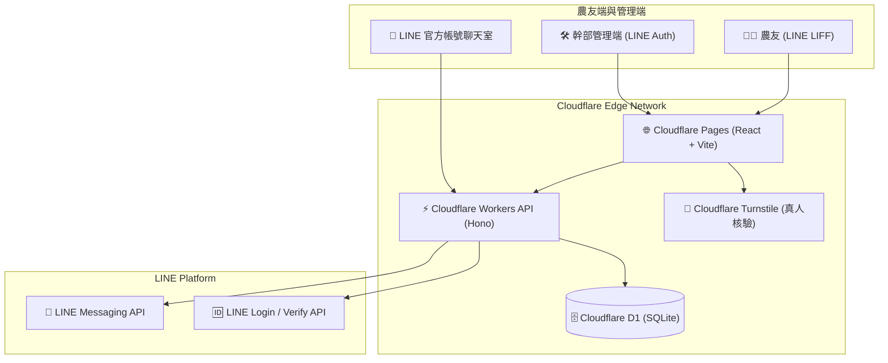

# 🌱 open-booking-line — LINE 開源預約管理系統

全純文字輕量化、高效能且安全嚴謹的 LINE 預約與在地服務管理系統。基於 **Cloudflare Serverless（Workers + D1 + Pages）** 與 **LINE LIFF** 架構打造，無需負擔高昂伺服器與資料庫月租費，全案皆可在 Cloudflare 與 LINE 免費額度內極速運行。

> 🤖 **AI Agent 協同入口規範**：請參閱 **[AGENTS.md](AGENTS.md)**，所有 AI 工具進入專案之首要讀取約束與核心守則。  
> 📖 **本集更新與歷史變更**：請參閱 **[CHANGELOG.md](CHANGELOG.md)**。

> [!IMPORTANT]
> **教學影片與專案最新狀態同步聲明**：  
> 隨著開源社群與在地農友實際使用回饋，本專案之各項能力（包含 EP01 全面升級為「4 步驟精緻導覽精靈」、隱私草稿防護、WCAG 雙指無障礙縮放等）已持續迭代升級。**若教學影片中的展示畫面或流程與當前專案程式碼有所出入，請一律以 GitHub 專案最新原始碼與文件說明為準。**

---

## 🌟 Current Capabilities (目前已驗證功能)

以下為目前主幹分支（`main`）經實機端對端驗收通過之穩定功能：

* ✓ **LINE 原生流暢預約 (LIFF 4 步驟導覽精靈)**：全面採用 4 步驟分段導覽（需求項目 ➔ 地點時段 ➔ 聯絡資料 ➔ 核對送出），依農友思考順序直覺引導；支援農家共用手機隱私草稿保護（自最後修改保留 7 天、開啟時詢問還原）、WCAG 無障礙雙指縮放、全按鈕觸控大熱區（$\ge 48\text{px}$）、返回鍵與防跳步保護，並自動帶入 LINE 暱稱；具備步驟 4 核對送出防幽靈送單機制（解耦原生 submit、React key 節點隔離、500ms 換步安全冷卻時間與全域 Enter 鍵防誤觸）。
* ✓ **LINE Rich Menu 圖文選單體系**：支援一鍵探索、SVG + Sharp 零外部依賴本地確定性渲染 2500x1686 溫潤大地選單；支援**全體農友 2 宮格選單**與**合作社幹部專屬「4 大宮格調度工作台」（待審確認、施工排程、休假預定、代客排單，支援 LIFF 深層直達參數與 Per-User 權限隔離動態綁定）**，具備雜湊審核門禁、原子化發布、遠端校驗與安全回滾機制。
* ✓ **時段可用性與確認排程 (Availability & Confirmation)**：
  * **Request ≠ Reservation 領域分離**：農友端僅能選擇寬鬆偏好時段（上午/下午/都可以），Pending 絕不占用時段。
  * **Availability 計算引擎**：支援 `Weekly Rules - Exceptions - Active Reservations - Past Dates`，具備 Legacy/Managed 漸進模式轉換。
  * **管理端電話確認排程**：指定正式日期與開工時間白名單（排除 12:00/12:30 午休），原子建立 `slot_reservations` 並排程防衝突。
  * **原子改期與取消釋放**：改期碰撞安全回滾（保全原預約），取消案件自動釋出時段。
  * **合作社營業矩陣與公休管理**：公休例外封鎖卡片置頂（支援天候豪雨/臨時機具維修快速登打與 LINE 幹部選單【休假預定】深層直達）、週一至週日 14 區間開放矩陣、Fail-Closed 防呆阻斷、特定日期公休例外維護與衝突警示保全。
  * **即時排程確認推播與跨端顯示一致**：正式確認與改期推播專屬 LINE Flex 卡片，所有查詢 Webhook 與後台皆以 Reservation 為權威來源。
* ✓ **極低成本 Serverless 後端**：基於 Cloudflare Workers + Hono 框架，提供低延遲、高並發之預約處理與時段排程 API。
* ✓ **無伺服器關聯資料庫 (Cloudflare D1 與智慧引導)**：以 SQLite 儲存預約單與時段封鎖紀錄，免除資料庫維護負擔；支援 `npm run setup:db` 智慧配置工具，自動探測 Cloudflare 帳號既有資料庫，主動引導建立「全新獨立資料庫 (推薦)」或「沿用既有資料庫」（徹底防範同一個 Cloudflare 帳號下多個 LINE 官方帳號共用同一個 DB 造成的資料污染），自動更新 `wrangler.toml` 並套用 `schema.sql`；內建 Pre-flight 關鍵防呆，自動核對 `LIFF_ID` 前綴與 `LINE_LOGIN_CHANNEL_ID` 一致性（防止 ID 錯位導致身分驗證失敗與查無預約）、Worker 名稱衝突檢測與 Turnstile 狀態檢查。
* ✓ **LINE Flex Message 即時推播**：新預約送出時，即時推播通知站所幹部，支援一鍵撥號與後台跳轉。
* ✓ **Zero-Password 零密碼管理後台**：管理端 100% 透過 LINE 官方 ID Token 驗證服務人員白名單，手機端自動免密碼登入、桌機端掃碼授權，徹底拔除靜態密碼洩漏風險。
* ✓ **企業級安全防禦**：
  * Cloudflare Turnstile 無感真人防刷單驗證。
  * 原生 Web Crypto HMAC-SHA256 恆定時間 Webhook 驗簽。
  * 電信級 Client IP + Phone 複合滑動窗口頻率限制。
  * 資料庫全欄位長度防爆破與日誌敏感個資（PII）脫敏。

---

## 📺 YouTube Episode Guide (教學影片索引)

本專案採**「能力演進式（Evolution Capability）」**架構，每一集 YouTube 教學為專案增添一項經驗證的新能力。

| Episode | Capability | Status | Episode Guide | Snapshot Tag |
| :--- | :--- | :--- | :--- | :--- |
| **Ep01** | Basic Booking (預約核心) | **Stable** (已驗證) | [Ep01 Guide](docs/episodes/ep01-basic-booking/) | [`ep01-wizard-form`](https://github.com/chingfonlee/open-booking-line/releases/tag/ep01-wizard-form) / [`ep01-basic-booking`](https://github.com/chingfonlee/open-booking-line/releases/tag/ep01-basic-booking) |
| **Ep02** | LINE Rich Menu (圖文選單) | **Stable** (已驗證) | [Ep02 Guide](docs/episodes/ep02-rich-menu/) | [`ep02-admin-4grid`](https://github.com/chingfonlee/open-booking-line/releases/tag/ep02-admin-4grid) / [`ep02-admin-rich-menu`](https://github.com/chingfonlee/open-booking-line/releases/tag/ep02-admin-rich-menu) |
| **Ep03** | Availability & Confirmation (時段可用性與確認排程) | **Stable** (已驗證) | [Ep03 Guide](docs/episodes/ep03-availability/) | [`ep03-admin-settings-top`](https://github.com/chingfonlee/open-booking-line/releases/tag/ep03-admin-settings-top) / [`ep03-availability`](https://github.com/chingfonlee/open-booking-line/releases/tag/ep03-availability) |
| **Ep04** | Service Catalog (服務項目目錄與客製欄位) | **Planned** (規劃中) | — | — |
| **Ep05** | Notification & Broadcast (推播加固與排程提醒) | **Planned** (規劃中) | — | — |

> 📌 **說明**：
> 1. 新使用者預設直接 Clone 最新 `main` 分支即可。
> 2. 詳細執行 SOP 請參閱 `.agent/episodes/<episode-id>/TASK.md`。

---

## 🚀 How to Use (如何開始使用)

現階段專案正式支援 **Episode-by-Episode 循序建置路線**：

### 1. 取得最新程式碼
```bash
git clone https://github.com/chingfonlee/open-booking-line.git
cd open-booking-line
npm install
```

### 2. 準備前置資源
* **LINE 官方帳號 (LINE OA)** 及 **LINE Developers** 頻道（取得 Channel Access Token、Channel Secret、Channel ID、LIFF ID）。
* **Cloudflare 帳號**（免信用卡，具備 Workers 與 D1 權限）。
* 推薦使用 **AI Coding Agent**（例如 Antigravity、Claude Code、Cursor、OpenCode）協同部署。

### 3. 交由 AI Agent 執行部署
在專案根目錄直接對 AI 輸入：
> 「我想在目前專案安裝 Episode 01 basic-booking 能力，請引導我完成設定與部署。」

AI 會依據 `.agent/episodes/ep01-basic-booking/TASK.md` 檢查前置條件、引導設定，並在完成實機驗收後於本地 `.booking/project-state.json` 登錄已驗證能力。

---

## 📁 Architecture (系統架構)

### 系統拓撲

```mermaid
flowchart TD
    subgraph Client["農友端與管理端"]
        User["🧑‍🌾 農友 (LINE LIFF)"]
        Admin["🛠️ 幹部管理端 (LINE Auth)"]
        LineChat["📱 LINE 官方帳號聊天室"]
    end

    subgraph Edge["Cloudflare Edge Network"]
        Pages["🌐 Cloudflare Pages (React + Vite)"]
        Worker["⚡ Cloudflare Workers API (Hono)"]
        Turnstile["🤖 Cloudflare Turnstile (真人核驗)"]
        D1[("🗄️ Cloudflare D1 (SQLite)")]
    end

    subgraph LinePlatform["LINE Platform"]
        MessagingAPI["📨 LINE Messaging API"]
        LineLogin["🆔 LINE Login / Verify API"]
    end

    User --> Pages
    Pages --> Turnstile
    Pages --> Worker
    Worker --> D1
    Worker --> MessagingAPI
    LineChat --> Worker
    Admin --> Pages
    Worker --> LineLogin
```

### Monorepo 目錄劃分
```text
open-booking-line/
├── packages/
│   ├── shared/            # 前後端共用 TypeScript 型別與介面
│   ├── backend/           # Cloudflare Workers 後端 API (Hono 框架)
│   │   ├── src/           # 路由、LINE 訊息、Turnstile 校驗
│   │   └── wrangler.toml  # Cloudflare Worker 範本檔 (不含敏感金鑰)
│   └── frontend/          # Cloudflare Pages 前端 (React + Vite + Tailwind)
│       └── src/           # 表單元件 (ApplyForm)、管理後台 (AdminDashboard)
├── docs/                  # 人類閱讀之技術手冊與 Episode 導覽
│   ├── episodes/          # 每集白話導覽 (docs/episodes/epXX/README.md)
│   ├── SECURITY-AND-SECRETS.md # 金鑰管理與隱私界線
│   └── TROUBLESHOOTING.md # 跨集數集中除錯指南
├── .agent/                # AI Agent 規範與執行合約
│   ├── AGENT-RULES.md     # Agent 核心作業守則
│   └── episodes/          # 各集機器可讀合約 (episode.json + TASK.md)
├── .booking/              # 本地實例狀態登錄
│   ├── project-state.schema.json  # 狀態結構定義
│   └── project-state.json.example # 範例檔 (實際狀態受 .gitignore 保護)
├── CHANGELOG.md           # 產品演進日誌
├── AGENTS.md              # AI Agent 入口指引
└── README.md              # 產品首頁
```

---

## ⚙️ Configuration (設定與金鑰入口)

為確保開源安全性，本專案嚴格區分**公開設定**與**私有憑證**：

1. **公開環境範本**：
   * `packages/backend/wrangler.toml`：存放通用架構與環境變數佔位符，**禁止寫入真實 Database ID 或個人 LINE UID**。
2. **本地私有配置 (受 `.gitignore` 保護)**：
   * `packages/backend/wrangler.local.toml`：本地開發或部署時指定特定店家的 `database_id`、`ADMIN_LINE_IDS`、`STATION_NAME` 等。
   * `packages/frontend/.env`：指定前端 `VITE_LIFF_ID` 與 `VITE_STATION_NAME`。
3. **自動化輔助腳本與敏感密鑰注入**：
   * **資料庫智慧引導與防呆**：根目錄執行 `npm run setup:db`，自動探測現有 D1、引導多店家獨立資料庫隔離，並執行 LINE ID 雙向校驗。
   * **真人防護自動化配置**：根目錄執行 `npm run setup:turnstile`，一鍵自動建立或更新 Cloudflare Turnstile Widget。
   * 透過 Wrangler 直接注入 Worker 雲端 Secret（Zero-Disk 零落地託管，絕不儲存於本機檔案或 Git）：
     ```bash
     cd packages/backend
     npx wrangler secret put LINE_CHANNEL_ACCESS_TOKEN
     npx wrangler secret put LINE_CHANNEL_SECRET
     npx wrangler secret put TURNSTILE_SECRET_KEY
     ```

---

## 🔒 Security (安全基線與隱私守則)

本專案實施最高規格之開源安全標準：
- **Zero-Password 零密碼架構**：管理端僅依賴 LINE 官方 ID Token 驗簽，無靜態密碼洩漏與撞庫風險。
- **Zero-Disk 憑證保護**：所有 Access Token 與 Secret 僅在記憶體流轉，嚴禁寫入磁碟與 Git 倉庫。
- **Fail-Closed 嚴密防禦**：未通過真人驗證或缺少簽章之請求直接阻斷，保障免費資源額度。
- **詳細隱私與金鑰指南**：請參閱 **[docs/SECURITY-AND-SECRETS.md](docs/SECURITY-AND-SECRETS.md)**。

---

## 📚 Documentation (文件導覽)

* **給 AI Agent**：
  * [AGENTS.md](AGENTS.md) — AI Agent 作業入口指引。
  * [.agent/AGENT-RULES.md](.agent/AGENT-RULES.md) — Agent 核心作業守則與文件更新規則。
* **給人類開發者與使用者**：
  * [docs/episodes/](docs/episodes/) — 各集 YouTube 教學導覽手冊。
  * [docs/TROUBLESHOOTING.md](docs/TROUBLESHOOTING.md) — 共通問題集中故障排除指南。
  * [docs/SECURITY-AND-SECRETS.md](docs/SECURITY-AND-SECRETS.md) — 敏感金鑰管理與隱私安全規範。
  * [BEGINNER_GUIDE.md](BEGINNER_GUIDE.md) — 初學者白話圖文部署指南。
  * [DEPLOYMENT_GUIDE.md](DEPLOYMENT_GUIDE.md) — 手動開發者部署手冊。
  * [CHANGELOG.md](CHANGELOG.md) — 產品版本歷史紀錄。

---

## 📄 License (授權條款)

本專案採用 [MIT License](LICENSE) 開源授權。
