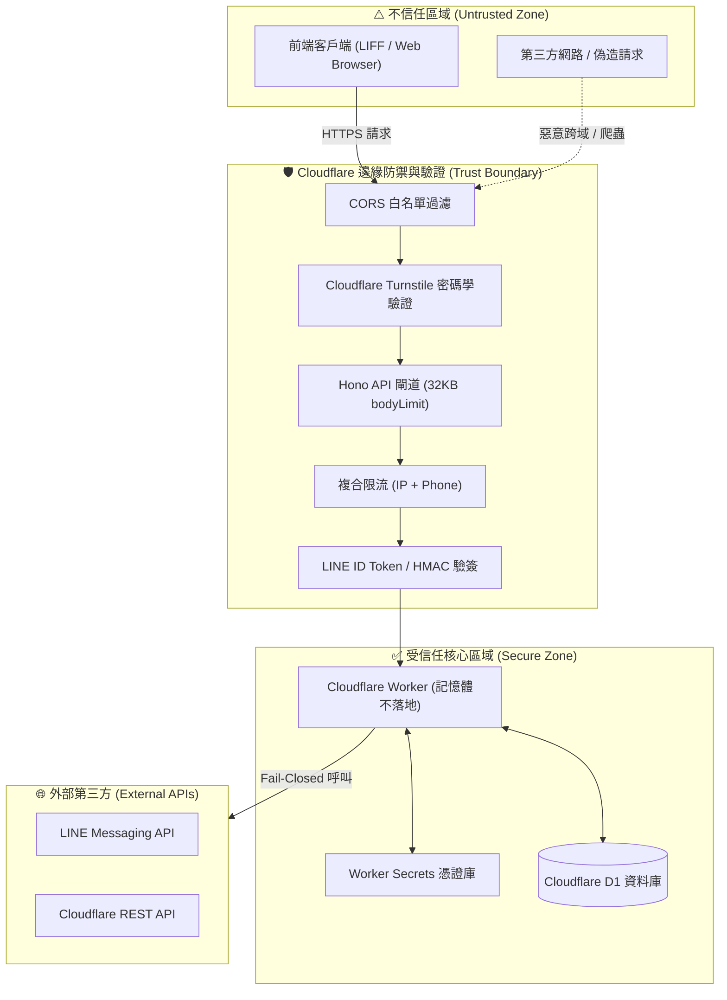

# 🛡️ 系統安全基線規範 (Security Baseline)

> **核心原則**：本文件定義專案開發與維護時**「不可違反的最低安全基線 (Non-Negotiable Baseline)」**。  
> 任何 AI Agent 或工程師在進行架構修改、新增 API、調整資料庫或執行部署自動化前，**必須優先遵守本規範**。

---

## 🔒 10 大不可違反的安全基線 (The 10 Golden Rules)

### 1. 客戶端輸入永遠不可信任 (Client input is always untrusted)
- 前端傳入之任何欄位（姓名、電話、地址、備註）必須於後端執行二次資料防呆與長度限制。
- 嚴格限制 Payload 大小（全站 32KB bodyLimit），防範記憶體耗盡（Memory Exhaustion）與阻斷服務攻擊。

### 2. 身分識別必須由伺服器端密碼學驗證 (Server-enforced Identity Verification)
- 嚴格禁止由前端直接傳入 `userId` 或角色權限並予以採信。
- 一般使用者與管理員身分必須透過 LINE Login 官方核發之 `id_token`，由後端使用 LINE 公鑰驗簽解碼取得 `sub`（User ID）。
- 管理員權限必須在後端 `ADMIN_LINE_IDS` 白名單嚴格比對，禁止任何前端權限旁路（Bypass）。

### 3. 憑證與密鑰零磁碟落地 (Zero-Disk Secrets Management)
- 所有 API Key、Channel Secret、Turnstile Secret **只允許存在於 Cloudflare Worker Secrets 或安全環境變數中**。
- **嚴禁將真實密鑰寫入 Git 倉庫、`.env` 檔案、`wrangler.toml`、測試日誌或磁碟檔案中**。

### 4. 敏感金鑰絕不輸出至日誌與錯誤訊息 (Zero-Leak Logging & Error Masking)
- 所有日誌禁止輸出未經過濾的 `request.body`、`headers` 或第三方原始回應。
- 對外回傳之錯誤訊息全面泛化（如回傳 `DATABASE_ERROR`），禁止將 SQL 語法、資料庫錯誤代碼或系統堆疊追蹤（Stack Trace）回傳給客戶端。

### 5. 第三方 Webhook 驗簽失敗預設全阻斷 (Fail-Closed Webhook Verification)
- 接收 LINE Webhook 時，必須以 `LINE_CHANNEL_SECRET` 進行 `HMAC-SHA256` 簽章運算。
- 驗證必須使用**恆定時間比較（Constant-time comparison）**，防止時序攻擊（Timing Attacks）。驗簽未通過立即阻斷（Fail-Closed, 401 Unauthorized）。

### 6. 生產環境真人檢核嚴格 Fail-Closed (Production Fail-Closed Verification)
- 進入生產環境後，Cloudflare Turnstile 驗證必須開啟 Fail-Closed 密碼學核驗。
- 任何無效 Token、過期 Token、虛擬測試金鑰（`1x...`、`2x...`、`3x...`）或驗證服務異常，一律拒絕預約送出，絕不降級放行。

### 7. 雲端資源佈署與腳本必須具備冪等性 (Idempotent Provisioning)
- 自動化腳本（如 Turnstile 建立、D1 初始化）重新執行多次時，結果必須與執行一次相同。
- 遵循三層復用邏輯：**本地 Key 復用 ➔ 遠端清單比對接管 ➔ 乾淨新建**，並提供 `--recreate` 明確重整旗標，嚴禁重跑腳本產生重複孤兒資源。

### 8. 正式環境與測試環境憑證徹底分離 (Credential & Environment Separation)
- 開發與測試階段僅允許使用官方公開測試金鑰（Always-Pass）。
- 生產環境部署時，自動切換至隔離之專屬 Site Key 與 Secret Key，測試用假資料不得污染生產資料庫。

### 9. 個人隱私資訊遮蔽（PII Masking）
- 日誌與推播除錯中，涉及電話號碼、身分證號、詳細地址等個資必須自動遮蔽（例如電話 `0912***456`）。
- API 查詢時採欄位投影（Projection），嚴禁使用 `SELECT *` 直接回傳包含內部備註（`admin_memo`）或未脫敏資料。

### 10. 自動化工具鏈嚴禁暴露原始輸出與 Shell 注入 (Agent-Safe & Zero-Shell)
- 自動化腳本全面拔除 `shell: true`，採用原生二進位執行（如 `process.execPath` 直調 JS 入口點），根絕 Shell Injection 漏洞。
- 子程序執行一律以記憶體緩衝區（Buffer）隔離，輸出經過白名單字典轉換，絕不向外部或 Agent 終端洩漏含有 Secret 的 raw stdout/stderr。

---

## 🎯 威脅模型檢核 (Threat Model Checklist)

在審查任何新功能時，必須詢問以下「惡意威脅」問題：

- [ ] **有人故意偽造別人的 LINE ID 查預約怎麼辦？**  
  👉 依賴 LINE Login ID Token 伺服器端驗簽解碼，禁止前端任意指定查詢 User ID。
- [ ] **有人用自動化腳本 1 秒送出 100 筆假預約怎麼辦？**  
  👉 由 Turnstile Managed 真人檢核 + IP/電話複合滑動視窗限流（Rate Limit）雙重封鎖。
- [ ] **有人嘗試在地址欄位輸入 10MB 的超長字串怎麼辦？**  
  👉 Hono 32KB bodyLimit 立即攔截拋出 413 Payload Too Large，且 Schema 限制 200 字元。
- [ ] **有人嘗試枚舉（Enumeration）預約單號怎麼辦？**  
  👉 預約單號採用 `BK-YYYYMMDD-10hex` 高熵亂數產生（$16^{10} \approx 1.1$ 兆種組合），徹底消除連續號猜測攻擊面。
- [ ] **有人從其他網站發起跨域請求盜用 API 怎麼辦？**  
  👉 後端動態驗證 CORS Origin 白名單，不合規來源一律拒絕跨域存取。

---

## 💥 失效模型檢核 (Failure Model Checklist)

在審查系統可靠性與自我修復能力時，必須詢問以下「非人為惡意、而是系統故障」問題：

- [ ] **Cloudflare Turnstile API 暫時 500 或斷網怎麼辦？**  
  👉 採取 Fail-Closed 原則，暫停受理預約並給予友善提示，絕不在無驗簽保護下降級放行。
- [ ] **Agent 執行自動化腳本中途斷線，重跑第二次怎麼辦？**  
  👉 腳本具備三層冪等性（本地復用 ➔ 遠端比對 ➔ 新建），自動偵測並同步既有資源，絕不堆疊孤兒資源。
- [ ] **雲端 Worker Secret 意外被手動刪除怎麼辦？**  
  👉 佈署腳本具備 Self-Healing（自我修復）機制，自動從雲端 Widget 提取配對 Secret 並經 `stdin` 重新灌回。
- [ ] **使用者手滑連續點擊送出按鈕兩次怎麼辦？**  
  👉 前端按鈕 Disable 防連點 + 預約單號與資料庫寫入防重機制。
- [ ] **資料庫連線逾時（Timeout）或出錯怎麼辦？**  
  👉 系統捕捉例外並以 `DATABASE_ERROR` 脫敏訊息回傳，內部堆疊寫入受限日誌，保護架構細節不外洩。
