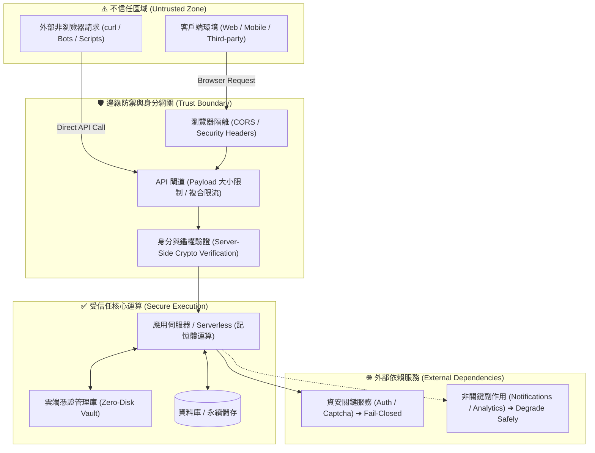

# 🛡️ 系統安全基線規範 (Security Baseline) — 通用工程原則

> **核心定位**：本文件定義所有專案開發與維護時**「不可違反的抽象安全基線 (Universal Non-Negotiable Baseline)」**。  
> 本規範為**跨平臺、語言無關（Platform-Agnostic）的通用工程準則**。  
> 具體專案（如 Cloudflare Workers、LINE Bot、Supabase 或 AWS 等）之技術對齊細節，請參閱各專案獨立的 [`SECURITY_PROFILE.md`](SECURITY_PROFILE.md)。

---

## 🔒 10 大不可妥協之通用安全基線 (The 10 Golden Rules)

---

### 1. 所有外部輸入必須具備伺服器端強制校驗 (Server-Side Input Validation)
- **原則**：客戶端傳入之任何輸入欄位（無論來自網頁、行動端或 Webhook）皆不可信任。
- **要求**：
  - 伺服器端必須限制 Request Body / Payload 總體積上限，杜絕記憶體耗盡（Memory Exhaustion）與 DoS 阻斷攻擊。
  - 所有欄位必須經由嚴格之資料 Schema 驗證（包含型別、長度上下限、格式正則檢查與列舉值過濾）。

### 2. 身分識別與授權由伺服器端密碼學強制實施 (Server-Enforced Authentication & Authorization)
- **原則**：嚴格禁止伺服器盲目信任由客戶端聲稱傳入之使用者 ID 或身分旗標。
- **要求**：
  - 身分必須由伺服器使用公鑰解碼或密碼學非對稱驗簽可信之 ID Token 取得。
  - 資源存取權限（Role/Permission）必須在伺服器端嚴格核對白名單或資料庫歸屬權，禁止前端邏輯旁路（Bypass）。

### 3. 憑證與密鑰零磁碟落地 (Zero-Disk Secrets Management)
- **原則**：任何 API Key、私鑰、簽名金鑰、資料庫連線字串皆屬於高機密憑證。
- **要求**：
  - 憑證僅能託管於雲端 Secret 服務（如 Secret Manager、Worker Secrets）或執行期記憶體中。
  - **嚴禁將真實密鑰存入 Git 版本庫、磁碟檔案（如 `.env`）、公開配置檔、或記錄至除錯日誌**。

### 4. 敏感資料遮蔽與錯誤訊息對外泛化 (Data Masking & Error Generalization)
- **原則**：對外介面與內部日誌必須落實最小揭露原則。
- **要求**：
  - 個人隱私資訊（PII：電話、身分證號、詳細地址等）在日誌與除錯追蹤中必須實施自動遮蔽。
  - 對外回傳之錯誤訊息全面代碼化與語意泛化，**禁止將內部資料庫語法、系統路徑、第三方 raw 錯誤或堆疊追蹤（Stack Trace）回傳客戶端**。

### 5. 第三方 Webhook 與回調強制密碼學驗簽 (Cryptographic Webhook Verification)
- **原則**：接收任何外部服務推播（如 LINE、Stripe、GitHub）時，必須確認來源真實性。
- **要求**：
  - 必須以預共享金鑰計算 HMAC 簽章，並使用**恆定時間比較演算法（Constant-Time Comparison）**，防範時序攻擊（Timing Attacks）。驗簽未通過者一律直接中斷（Fail-Closed, 401 Unauthorized）。

### 6. 依賴失效之雙軌分流原則 (Fail-Closed vs Safe Degradation)
- **原則**：**區分「資安關鍵依賴」與「非關鍵副作用依賴」之失效處理邏輯**。
- **要求**：
  - **資安關鍵依賴（Security-Critical）**（例如：真人 Captcha 檢核、身分驗證服務、Webhook 簽章）：  
    👉 **一律嚴格 Fail-Closed（安全阻斷）**。當外部驗證服務 500 或斷網時，寧可暫停交易，絕不降級盲目放行。
  - **非關鍵副作用依賴（Non-Critical Side-Effects）**（例如：推播通知、信件提醒、數據分析）：  
    👉 **安全降級並非同步重試（Degrade Safely & Retry）**。若核心交易（如預約成功寫入 DB）已完成，通知 API 暫態 500 不得回滾主要交易；系統應標記待發送狀態，交由非同步佇列稍後補發。

### 7. 雙層冪等性設計 (Dual-Layer Idempotency: Infrastructure & Business)
- **原則**：系統必須具備抵禦「重複執行」與「重放請求」之自我修復能力。
- **要求**：
  - **基礎設施冪等（Infrastructure / Provisioning Idempotency）**：雲端資源建立與部署腳本重新執行 $N$ 次的結果必須與執行 1 次相同。具備檢查既有資源、同步更新（Update/Reuse）之能力，絕不產生孤兒重複資源。
  - **業務邏輯冪等（Business Idempotency）**：核心狀態變更與寫入 API 不能只依賴前端 UI 按鈕 Disable。後端架構層必須具備 `Idempotency-Key`、資料庫唯一鍵約束（Unique Constraints）或 Webhook Event ID 去重機制，防範網路抖動引發的重複扣款或重複下單。

### 8. 正確劃分 CORS 與 API 真實安全邊界 (CORS is Browser Isolation, NOT API Security)
- **原則**：不可將 CORS 誤認為 API 後端的安全防火牆。
- **要求**：
  - **CORS（跨域資源共享）**：本質為**「瀏覽器端隔離機制」**，用以防範惡意網站利用合法使用者的瀏覽器 Cookie 竊取資料。
  - **API 本體安全**：任何非瀏覽器客戶端（如 `curl`、Postman、自動化 Python 腳本、惡意爬蟲）皆不受 CORS 限制。API 安全必須建立在 **身分鑑權（Token）、真人檢核（Turnstile）、頻率限制（Rate Limiting）與簽章驗證** 之上。

### 9. 正式環境與測試環境徹底隔離 (Credential & Environment Separation)
- **原則**：嚴禁測試憑證與資料污染正式營運環境。
- **要求**：
  - 測試環境採用公開或專用測試金鑰（如 Always-Pass Key），生產環境切換為高強度專屬金鑰。
  - 程式碼邏輯中必須明確偵測並排除測試金鑰流入正式環境（例如防止測試 Site Key 在生產環境被誤用）。

### 10. 自動化工具鏈原生安全與零注入 (Agent-Safe & Zero-Shell Provisioning)
- **原則**：AI Agent 執行之自動化工具與腳本必須消除所有注入途徑。
- **要求**：
  - 跨平臺執行程序全面拔除 `shell: true`，採用原生二進位執行（如由 Node.js 直調 JS 入口點），杜絕 Shell Injection 攻擊面。
  - 執行輸出採用緩衝記憶體隔離與白名單字典轉換，嚴防包含敏感 Secret 的 raw stdout/stderr 流入日誌。

---

## 🎯 雙模型評估框架 (Threat & Failure Model Framework)

在架構設計完成、寫扣之前，必須對系統執行以下兩大維度問答：

### 1. 威脅模型 (Threat Model) ——「有人故意攻擊會怎樣？」
1. **身分偽造**：攻擊者是否能偽造身分識別發起請求？（透過伺服器公鑰驗簽抵禦）
2. **重放攻擊**：攻擊者截獲合法封包重複發送會怎樣？（透過 Nonce、時戳、單號亂數或狀態機抵禦）
3. **爆破與阻斷**：攻擊者用高頻並發灌爆系統會怎樣？（透過複合限流與 Captcha 抵禦）
4. **巨量封包攻擊**：攻擊者傳入畸形長字串會怎樣？（透過 Payload 上限與 Schema 限制抵禦）

### 2. 失效模型 (Failure Model) ——「沒人攻擊，純粹系統出錯或重跑會怎樣？」
1. **資安驗證服務異常**：Captcha 或 Auth 伺服器掛掉時，是 Fail-Closed 還是 Fail-Open？
2. **外部通知服務異常**：發訊 API 斷線時，核心交易是否會被錯誤回滾？（應安全降級與重試）
3. **部署與維運重跑**：腳本跑到一半斷線重來，是否能安全復原？（應自動三層復用與自我修復）
4. **網路重傳抖動**：使用者端網路延遲導致送出兩次，後端是否會寫入兩筆重複資料？（應靠業務冪等設計抵禦）
