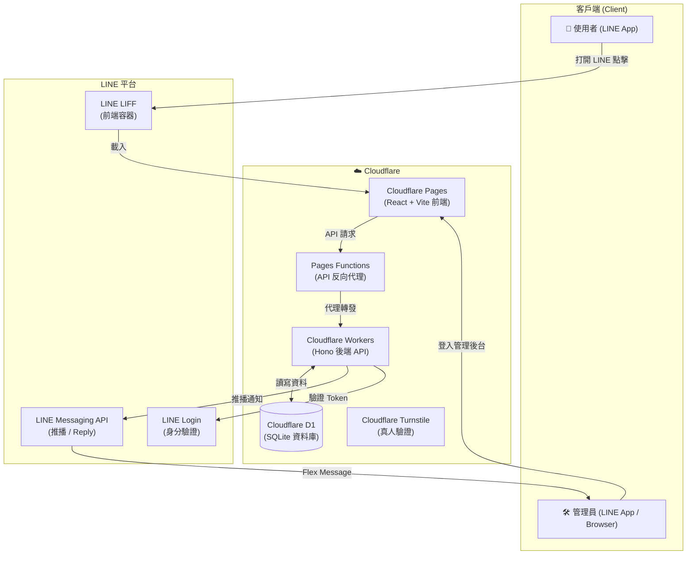

# Architecture — 系統架構說明

> 本文件說明 open-booking-line 的系統架構，包含技術棧、模組職責與資料流。
> 如有任何與程式碼不一致之處，**以程式碼為準**。

---

## 🏛️ 系統拓撲（System Topology）



---

## 🧱 Monorepo 結構

```
open-booking-line/
├── packages/
│   ├── shared/            # 前後端共用型別定義
│   │   └── types.ts       # TypeScript 型別與常數
│   │
│   ├── backend/           # Cloudflare Workers 後端
│   │   ├── src/
│   │   │   ├── index.ts   # API 路由（Hono）
│   │   │   ├── line.ts    # LINE Flex Message / API
│   │   │   └── turnstile.ts # Turnstile 驗證
│   │   ├── schema.sql     # D1 資料庫 Schema
│   │   └── wrangler.toml  # Worker 設定
│   │
│   └── frontend/          # Cloudflare Pages 前端
│       ├── src/
│       │   ├── components/
│       │   │   ├── ApplyForm.tsx     # 預約表單
│       │   │   └── AdminDashboard.tsx # 管理後台
│       │   ├── App.tsx               # 路由
│       │   └── config.ts             # API Base URL
│       ├── functions/
│       │   └── api/[[catchall]].ts   # Pages Functions 代理
│       └── public/
│           └── _headers              # 安全 Headers
│
├── scripts/               # 工具腳本
│   └── setup-turnstile.js # Turnstile 自動配置
│
└── docs/                  # 技術文件（本目錄）
```

---

## 📦 模組職責

| 模組 | 技術 | 職責 |
| :--- | :--- | :--- |
| `packages/shared/` | TypeScript | 前後端共用型別、常數定義 |
| `packages/backend/` | Hono + Cloudflare Workers | REST API、LINE Webhook、D1 操作、安全驗證 |
| `packages/frontend/` | React + Vite + Tailwind | 預約表單（LIFF）、管理後台 |
| `packages/frontend/functions/` | Cloudflare Pages Functions | API 反向代理（避免跨域問題） |

---

## 🌐 API Endpoints

| Method | Path | 描述 | 需要認證 |
| :--- | :--- | :--- | :--- |
| GET | `/api/health` | Health check | 否 |
| POST | `/api/requests` | 送出服務申請 | Turnstile Token |
| POST | `/api/admin/auth/line` | 管理員 LINE 身分驗證 | 否（公開） |
| GET | `/api/admin/requests` | 取得申請單列表 | LINE Admin Token |
| PATCH | `/api/admin/requests/:id` | 更新申請單狀態/備註 | LINE Admin Token |
| GET | `/api/config/blocked-dates` | 取得封鎖日期 | 否 |
| POST | `/api/admin/blocked-dates` | 新增/移除封鎖日期 | LINE Admin Token |
| GET | `/api/line/webhook` | Webhook 健康確認 | 否 |
| POST | `/api/line/webhook` | LINE Webhook 接收 | LINE Signature |
| GET | `/api/admin/debug/test-card` | 測試推播 | LINE Admin Token |

---

## 🗄️ 資料庫 Schema

> 完整說明請參閱 [database.md](database.md)

### service_requests 表（預約申請）

```sql
CREATE TABLE IF NOT EXISTS service_requests (
  id TEXT PRIMARY KEY,          -- REQ-YYYYMMDD-10HEX
  created_at TEXT NOT NULL,     -- ISO8601
  updated_at TEXT NOT NULL,     -- ISO8601
  contact_name TEXT NOT NULL,   -- 聯絡姓名 (≤50字)
  phone TEXT NOT NULL,          -- 聯絡電話
  service_type TEXT NOT NULL,   -- 服務項目
  crop_type TEXT NOT NULL,      -- 作物種類
  area_size TEXT NOT NULL,      -- 面積（組合字串）
  area_value TEXT,              -- 面積數值
  area_unit TEXT,               -- 面積單位
  branch_volume TEXT,           -- 枝條數量
  location_area TEXT NOT NULL,  -- 服務地區
  location_address TEXT NOT NULL, -- 詳細地址 (≤200字)
  preferred_date TEXT NOT NULL, -- 希望日期 YYYY-MM-DD
  preferred_time_slot TEXT NOT NULL, -- 時段 morning/afternoon/any
  date_flexibility TEXT,        -- 日期彈性
  notes TEXT,                   -- 備註 (≤1000字)
  status TEXT NOT NULL DEFAULT 'to_contact', -- to_contact/processing/closed
  admin_memo TEXT,              -- 內部備註（不對使用者公開）
  line_user_id TEXT             -- LINE User ID（驗證後才寫入）
);
```

### blocked_dates 表（封鎖日期）

```sql
CREATE TABLE IF NOT EXISTS blocked_dates (
  date TEXT PRIMARY KEY,   -- YYYY-MM-DD
  reason TEXT,             -- 封鎖原因
  created_at TEXT NOT NULL
);
```

---

## 🔒 安全架構

請參閱 [SECURITY_PROFILE.md](../SECURITY_PROFILE.md) 了解完整安全實作規格。

關鍵安全機制：
- Cloudflare Turnstile 強制真人驗證
- LINE Webhook HMAC-SHA256 簽名驗證
- Zero-Password 管理後台（LINE ID Token 白名單）
- 欄位長度限制（防 D1 爆炸）
- `admin_memo` 欄位白名單保護
- 複合式頻率限制（IP + Phone）

---

## 🔧 Customization Architecture（客製化架構）

請參閱 [customization.md](customization.md) 了解三層客製化概念。

```
Level 1 — Configuration Only（環境變數設定）
    → 合作社名稱、品牌色、服務地區
    → 不需要改程式碼

Level 2 — Form Customization（表單客製化）
    → 修改 shared/types.ts + 前端表單 + 後端驗證
    → 新增/修改服務欄位

Level 3 — Schema / Business Logic（資料庫與業務邏輯）
    → 修改 D1 Schema + Migration
    → 進階客製化
```

---

> ⚠️ **注意**：本文件持續更新中。如有任何與程式碼不一致之處，以程式碼為準。
> 發現不一致時，請在 GitHub 開 Issue 或提交 PR 修正。
