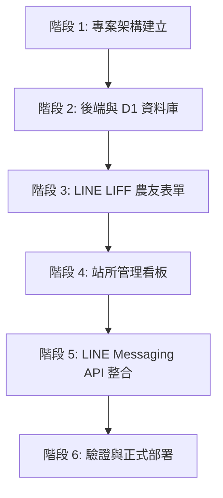

# 「行農合作社｜服務申請管理」系統規格與實作計畫 (Spec & Plan)

> **版本**：v1.0-starter-prod  
> **定位**：極簡直覺的「客戶填單 ➔ 合作社收單 ➔ 撥電話 ➔ 標記狀態」輕量服務申請系統。  
> **目標**：讓合作社人員第一次看就懂、願意天天打開手機操作，不增加任何認知負擔。

---

## 一、產品邊界與嚴格限制 (Product Boundaries & Constraints)

### 1. 核心業務流程
```
農友 (LINE LIFF)                合作社站所 (LINE 推播 + 管理介面)
      │                                       │
      ├─ 1. 一次填寫完整需求單 ──────────────>│
      │   (作物/地點/希望日期/時段/姓名/電話)  ├─ 2. 收到 LINE Flex Message 通知
      │                                       ├─ 3. 點開管理介面查看需求清單
      │                                       ├─ 4. 一鍵撥打電話聯絡確認
      │                                       └─ 5. 標記狀態 (待聯絡/處理中/已結案)
```

### 2. 絕對不包含的功能 (Strict Out-of-Scope)
- ❌ **不具備複雜自動排程與派工**：沒有師傅清單、沒有機具指派、沒有時間軸甘特圖。
- ❌ **不具備照片/檔案上傳**：無相機權限、無 R2/S3 儲存桶依賴，表單零阻力。
- ❌ **不提分級方案與價格**：不提 Starter/Management/Dispatch，不顯示任何 $500/$990 價格或升級按鈕。
- ❌ **不使用「施工日期」字眼**：統一稱呼為「希望施工日期」與「偏好時段（上午 / 下午 / 皆可）」，由電話聯絡最終拍板。

---

## 二、技術架構 (Technology Architecture)

```
┌─────────────────────────────────────────────────────────────┐
│                          LINE 生態圈                         │
│  - 農友 Rich Menu 點擊 ➔ 打開 LIFF 表單 (/apply)            │
│  - 站所人員接單 ➔ Messaging API 推播 Flex 訊息 (含一鍵撥號)  │
│  - 站所人員後台 ➔ LIFF / Web 管理看板 (/admin)              │
└──────────────────────────────┬──────────────────────────────┘
                               │ HTTPS
                               ▼
┌─────────────────────────────────────────────────────────────┐
│              Frontend (SPA / LIFF Webview)                  │
│  - 框架：Vite + React 18 + TypeScript                       │
│  - 樣式 & 元件庫：Tailwind CSS + shadcn/ui                   │
│    · Sheet (右側滑出詳情抽屜)                                 │
│    · Card / Badge (卡片列表與三色狀態標籤)                  │
│    · RadioGroup (狀態切換：待聯絡 / 處理中 / 已結案)          │
│    · Button (大綠色 tel: 一鍵通話按鈕)                      │
│  - LINE 整合：@line/liff (v2)                               │
└──────────────────────────────┬──────────────────────────────┘
                               │ REST API / JSON
                               ▼
┌─────────────────────────────────────────────────────────────┐
│           Backend: Cloudflare Workers + Hono (TS)           │
│  - Webhook 模組：LINE Messaging API 簽名校驗 (crypto)       │
│  - LIFF 模組：驗證 LIFF ID Token (防偽造身分)                │
│  - 業務 API：                                               │
│    · POST /api/requests (農友送出申請 + 觸發 LINE 推播)     │
│    · GET  /api/admin/requests (站所載入清單，支援狀態篩選)   │
│    · PATCH /api/admin/requests/:id (更新處理狀態 + 備註)    │
│    · GET  /api/config/blocked-dates (預留：手動關閉日期查詢) │
└──────────────────────────────┬──────────────────────────────┘
                               │ SQL
                               ▼
┌─────────────────────────────────────────────────────────────┐
│                 Database: Cloudflare D1 (SQLite)            │
│  - 表 1：service_requests (服務申請單主表)                  │
│  - 表 2 (擴充預留)：blocked_dates (手動關閉預約日期黑名單)   │
└─────────────────────────────────────────────────────────────┘
```

---

## 三、資料庫綱要設計 (Database Schema - Cloudflare D1)

### 1. 服務申請主表 `service_requests`
```sql
CREATE TABLE IF NOT EXISTS service_requests (
  id TEXT PRIMARY KEY,                       -- 如 REQ-20260922-001
  created_at TEXT NOT NULL,                  -- ISO8601 (UTC+8)
  updated_at TEXT NOT NULL,                  -- ISO8601 (UTC+8)
  
  -- 農友與農地資訊
  contact_name TEXT NOT NULL,                -- 姓名
  phone TEXT NOT NULL,                       -- 聯絡電話
  service_type TEXT NOT NULL,                -- 服務項目 (果樹枝條粉碎/果樹代耕/農機出租/其他農業服務)
  crop_type TEXT NOT NULL,                   -- 作物種類 (芭樂/蜜棗/芒果/竹子/其他)
  area_size TEXT NOT NULL,                   -- 預估面積 (分地、甲或幾分)
  location_area TEXT NOT NULL,               -- 區域 (如：燕巢區、大社區、阿蓮區)
  location_address TEXT NOT NULL,            -- 地段/地號或詳細地址/地標
  
  -- 預約期望
  preferred_date TEXT NOT NULL,              -- 希望施工日期 (YYYY-MM-DD)
  preferred_time_slot TEXT NOT NULL,         -- 偏好時段 ('morning' 上午 | 'afternoon' 下午 | 'any' 皆可)
  notes TEXT,                                -- 備註補充說明
  
  -- 狀態管理
  status TEXT NOT NULL DEFAULT 'to_contact', -- 'to_contact' 待聯絡 | 'processing' 處理中 | 'closed' 已結案
  admin_memo TEXT,                           -- 站所內部備註 (非農友可見)
  
  -- LINE 識別 (選填)
  line_user_id TEXT                          -- 送單者的 LINE UID (供日後發送狀態通知使用)
);

CREATE INDEX IF NOT EXISTS idx_requests_status ON service_requests(status);
CREATE INDEX IF NOT EXISTS idx_requests_preferred_date ON service_requests(preferred_date);
CREATE INDEX IF NOT EXISTS idx_requests_created_at ON service_requests(created_at DESC);
```

### 2. 擴充預留：手動關閉日期黑名單 `blocked_dates`
> （由站所人員在後端手動點擊「某天公休/額滿，不讓農友選擇」）
```sql
CREATE TABLE IF NOT EXISTS blocked_dates (
  date TEXT PRIMARY KEY,                     -- YYYY-MM-DD
  reason TEXT DEFAULT '當日服務站調配額滿',    -- 關閉原因
  created_at TEXT NOT NULL
);
```

---

## 四、API 介面規格 (API Specifications)

| 方法 | 路徑 | 權限/身分 | 說明 |
|---|---|---|---|
| `POST` | `/api/requests` | 公開 / LIFF 用戶 | 農友提交服務申請。成功寫入 D1 後，異步觸發 LINE Messaging API 推播 Flex 訊息給站所管理群組。 |
| `GET` | `/api/admin/requests` | 站所人員 (Auth) | 查詢所有服務申請，支援 Query `status=to_contact\|processing\|closed`，依建立時間倒序。 |
| `PATCH` | `/api/admin/requests/:id` | 站所人員 (Auth) | 更新單筆狀態 (`status`) 與站所備註 (`admin_memo`)。 |
| `GET` | `/api/config/blocked-dates` | 公開 | 取得已被站所手動標記關閉的日期陣列，供 LIFF 日曆禁用。 |
| `POST` | `/api/admin/blocked-dates` | 站所人員 (Auth) | 新增/移除關閉日期。 |
| `POST` | `/api/webhook` | LINE Webhook | 接收 LINE 訊息與加入好友事件。 |

---

## 五、UI / UX 與 shadcn/ui 元件規範

### 1. 農友端表單 (`/apply` - LIFF Webview)
- **視覺風格**：大地綠色系（Primary: `emerald-600` / `green-700`），簡潔農村友善風格，字體加重放大。
- **欄位組件**：
  1. 服務項目（`Select` 或大型卡片點選）
  2. 作物種類（`Input`，帶預設快捷標籤：芭樂、棗子、蜜棗、芒果、水稻）
  3. 預估面積（`Input`，提示如「3 分地」、「1 甲」）
  4. 施工地點（行政區 `Select` + 地段地號/地址 `Input`）
  5. 希望施工日期（`Calendar` / `DatePicker`，禁用歷史日期與 `blocked_dates`）
  6. 偏好時段（`RadioGroup`：上午 / 下午 / 皆可）
  7. 聯絡人姓名與電話（自動帶入 LINE 暱稱或手動填寫）
- **按鈕**：底部固定大按鈕「確認送出申請」（觸發 `Sonner` 提示，關閉 LIFF 視窗或跳轉感謝畫面）。

### 2. 站所管理端看板 (`/admin` - 支援手機與平板/桌機)
- **頂部 Header**：高雄服務站 · 服務申請管理
- **統計篩選列**（shadcn `Tabs` 或狀態 Filter Badge）：
  - 全部 (`all`)
  - 待聯絡 (`to_contact` - 預設高亮，紅色/琥珀色點標記待辦數)
  - 處理中 (`processing` - 藍色標記)
  - 已結案 (`closed` - 灰色標記)
- **申請單卡片** (`Card`)：
  - 清楚呈現：**農友姓名**、**聯絡電話**、**服務項目**、**作物與面積**、**希望施工日期與時段**、**地點**。
  - 右上角狀態 Badge。
  - 卡片下方附綠色高對比 `Button`：**「撥打電話 (tel:...)」**。
- **單筆詳情抽屜** (shadcn `Sheet`)：
  - 點擊卡片彈出。
  - 快速切換狀態：`to_contact` ➔ `processing` ➔ `closed`。
  - 站所內部備註輸入框 (`Textarea`)。

---

## 六、實作階段計畫 (Implementation Roadmap)



### 階段 1：專案骨架與套件初始化
- 建立 monorepo 或標準前後端目錄結構：
  - `apps/web/`：Vite + React + TypeScript + Tailwind CSS + shadcn/ui + `@line/liff`
  - `apps/api/`：Cloudflare Workers + Hono + `@cloudflare/workers-types`
- 安裝與設定 shadcn/ui 元件（button, card, sheet, badge, radio-group, sonner, input, select, calendar 等）。

### 階段 2：Cloudflare Workers (Hono) + D1 建立
- 編寫 `schema.sql` 並執行本地/遠端 D1 Migration。
- 實作 Hono 路由：
  - CRUD 服務申請單。
  - 支援手動關閉日期查詢。

### 階段 3：LINE LIFF 農友申請表單 (`/apply`)
- 整合 `@line/liff` 初始化並獲取用戶 profile。
- 實作乾淨直覺的大字體無阻力表單（無照片、清晰希望日期與時段）。
- 提交至 Workers API 並呈現成功通知。

### 階段 4：站所後台看板 (`/admin`)
- 實現「待聯絡 / 處理中 / 已結案」三狀態篩選。
- 卡片式排版與一鍵撥號按鈕。
- shadcn `Sheet` 滑出詳情抽屜與狀態切換。

### 階段 5：LINE Messaging API 推播串接
- 農友送單成功時，後端透過 LINE Messaging API 發送 Flex Message 給站所管理員 / 群組。
- Flex 訊息內含：申請摘要、一鍵通話按鈕、查看後台連結。

### 階段 6：驗收與端到端測試 (Verification)
- 驗證「無多餘功能、無照片上傳、無等級定價」。
- 驗證手機 LINE 瀏覽器內滑動順暢度與一鍵撥號功能。
